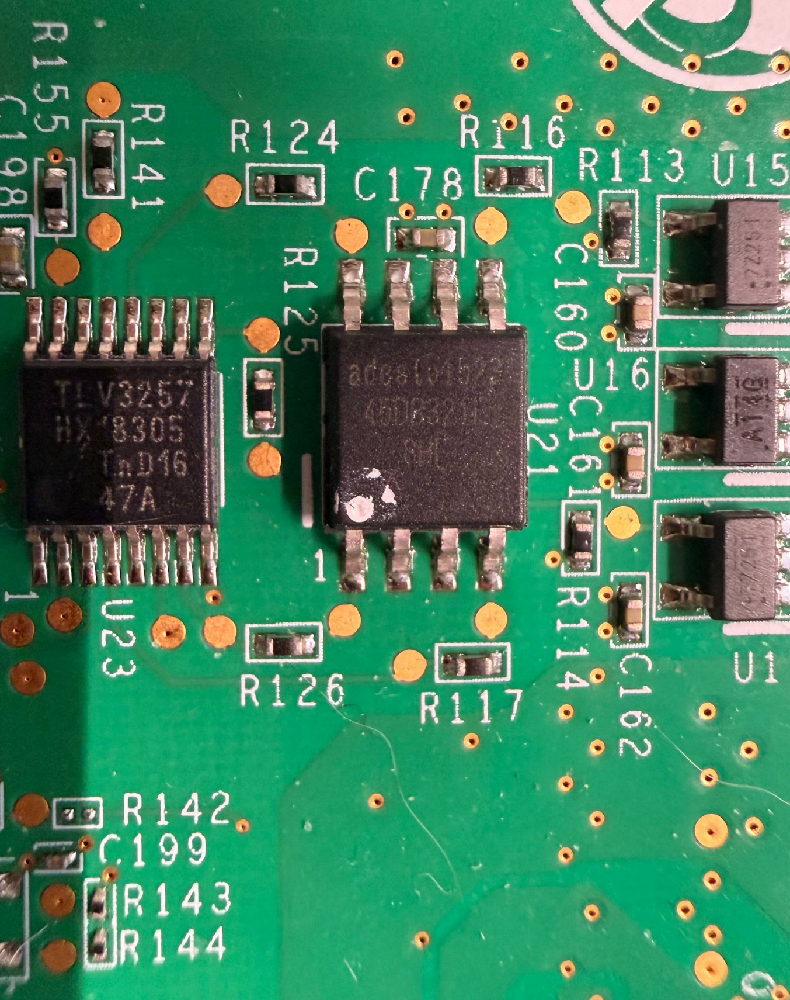
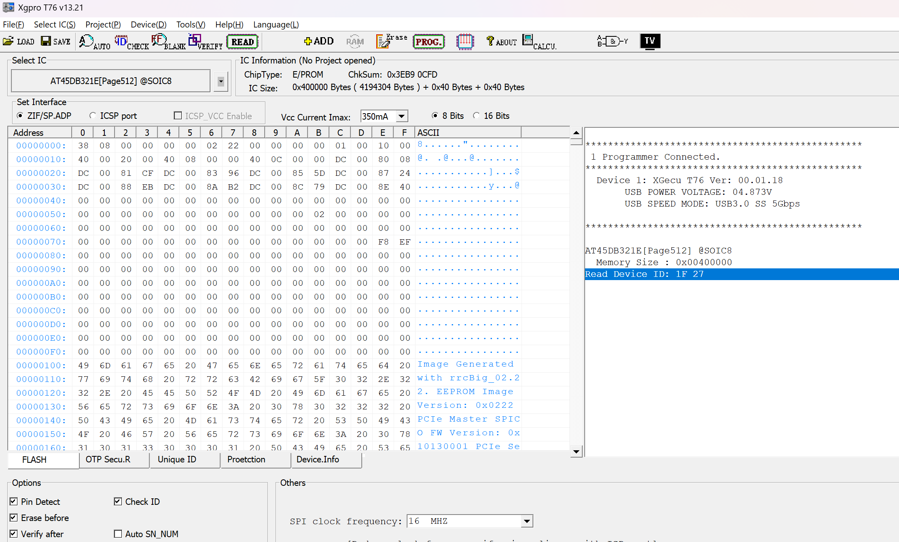

# FM10K烹饪指南——把你的UIO挪到PCIE侧

> 本文章只适用使用FM10840的Silicom PE31625G24DIRA 卡 尽情的开发吧！

## 工具准备

首先，重中之重的事情就是你需要去备份你的Flash。

所以你至少需要有一个编程器可以读写 *AT45DB321E[Page512]* 。否则刷坏了就很难去恢复（软件恢复也需要有UIO）

剩下的两个工具分别是[fm10k-dump](https://git.gammaspectra.live/FM10K/fm10k-dump)和 [rrcSmall](https://git.gammaspectra.live/FM10K/rrcSmall)（能用软件去Dump，谁又会喜欢接编程器呢）

## 固件备份

首先在背面找到这颗AT45DB321E位于U21，随后开始堆固件进行备份



夹上夹子！开干！（我想买DediProg SF600 Plus-G2!!!)



好了，在这里备份好固件可以避免后续改错配置无法通过软件恢复。

当然，软件的备份反而简单了许多。**下面的操作需要从小板上进行。**

```bash
# git clone https://git.gammaspectra.live/FM10K/fm10k-dump.git
# cd fm10k-dump
# make
# ./fm10k-dump baekup.bin
Taken SPI Lock
FM10K device found at /sys/bus/pci/devices/0000:01:00.0/resource4 :: Vendor 0x8086 :: Class 0x15a4
Manufacturer Info 0x0101271f :: JEDEC Manufacturer ID 0x1f family 0x01 density 0x07 00:01
SPI Device: Adesto AT45DB321E 32-Mbit
read @ 0x003ffe00 / 0x00400000 512 bytes
Released SPI Lock
Read 4194304 bytes
```

在这里，如果你没有/dev/uio0，那你将无法修改并会遇到报错

**Unable to find FM10K device with BAR4 port access, or could not take SPI lock. Check bifurcation settings?**


## 修改固件

修改固件这一步骤就是没什么风险的了，但是这里有一点需要注意。

**如果你在使用PE31625G24DIRA 自带的系统ubuntu16，你所安装的cmake将不会满足CMakeLists.txt里面的cmake_minimum_required(VERSION 3.16)，在这里你可以大胆的修改到cmake_minimum_required(VERSION 3.5)**

```
git clone https://git.gammaspectra.live/FM10K/rrcSmall.git
cd rrcSmall/
mkdir build && cd build
cmake ../ && make
```

rrcSmall 
Usage:
    decode: ./rrcSmall decode nvmImage.bin > decoded.txt
    encode: ./rrcSmall encode originalNvmImage.bin settings.cfg patchedNvmImage.bin

你可以使用decode去修改

- `api.platform.config.switch.0.bootCfg.systimeClockSource` bool
- `api.platform.config.switch.0.bootCfg.spiTransferMode` int
- `api.platform.config.switch.0.bootCfg.spiTransferSpeed` int
- `api.platform.config.switch.0.bootCfg.customMac.%` text
- `api.platform.config.switch.0.bootCfg.mgmtPep` int
- `api.platform.config.switch.0.bootCfg.pep.%.bar4Allowed` bool
- `api.platform.config.switch.0.bootCfg.pep.%.serialNumber` text
- `api.platform.config.switch.0.bootCfg.pep.%.vendorId` int
- `api.platform.config.switch.0.bootCfg.pep.%.deviceId` int
- `api.platform.config.switch.0.bootCfg.pep.%.subVendorId` int
- `api.platform.config.switch.0.bootCfg.pep.%.subDeviceId` int
- `api.platform.config.switch.0.bootCfg.pep.%.numberOfLanes` int
- `api.platform.config.switch.0.bootCfg.pep.%.gen` int
- `api.platform.config.switch.0.bootCfg.pep.%.ASPMEnable` bool
- `api.platform.config.switch.0.bootCfg.pep.%.enable` bool
- `api.platform.config.switch.0.bootCfg.pep.%.mode` bool

而我们本次需要修改的内容就是api.platform.config.switch.0.bootCfg.mgmtPep，把从4修改到0

我们可以新建一个文件并且将api.platform.config.switch.0.bootCfg.mgmtPep int 0这个配置写入其中（我这里用的是mgmtpep0.cfg）。最后进行patch

```
./rrcSmall encode dump.bin mgmtpep0.cfg patched.bin 
```

## 把变动写回到Flash里

这里还是需要fm10k-dump这个项目里的flash来帮忙。

由于flash之前，它需要去对之前的备份文件进行校验，所以我们第一个参数是修改后的文件，第二个则是修改前的。

```
./fm10k-flash patched.bin dump.bin 
Taken SPI Lock
FM10K device found at /sys/bus/pci/devices/0000:02:00.0/resource4 :: Vendor 0x8086 :: Class 0x15a4
Manufacturer Info 0x0101271f :: JEDEC Manufacturer ID 0x1f family 0x01 density 0x07 00:01
SPI Device: Adesto AT45DB321E 32-Mbit
backup check @ 0x003ffe00 / 0x00400000 512 bytes
Backup matches.
Disabling sector protection.
write @ 0x00002000
write @ 0x00089000
write @ 0x00089200
write @ 0x000c9000
write @ 0x000c9200

verify check @ 0x003ffe00 / 0x00400000 512 bytes
Data written verified.

Released SPI Lock

Written 4194304 bytes
```

写入完成后需要重启整张卡以保证reset成功。（暂时还没写把小板去掉后的固件应该如何修改，动力不大日后遇到再说）

## 验证

由于这个项目使用的是netlab-fm10k-driver的修改版驱动，所以可以在dmesg中查看bar4的情况。**下面的操作开始在PCIE侧设备上进行，不要移除小板，否则交换芯片初始化会出现奇怪问题**

```
[    1.791269] fm10k: loading out-of-tree module taints kernel.
[    1.792202] fm10k: module verification failed: signature and/or required key missing - tainting kernel
[    1.795628] NetLab Switch OS fm10k Ethernet Switch Host Interface Driver - version 0.27.1-netlab
[    1.799950] fm10k 0000:01:00.0: FM10K_CTRL=0x00000005 BAR4_ALLOWED=1
[    1.801194] fm10k 0000:01:00.0: BAR4 mapping: start=0xe0e00000000 len=0x4000000 sw_addr=00000000747f2e94
[    1.826687] fm10k 0000:01:00.0: 63.008 Gb/s available PCIe bandwidth (8.0 GT/s PCIe x8 link)
[    1.830460] fm10k 0000:02:00.0: FM10K_CTRL=0x00000001 BAR4_ALLOWED=0
[    1.830465] fm10k 0000:02:00.0: BAR4 access disabled by FM10K_CTRL
[    1.850855] fm10k 0000:02:00.0: 63.008 Gb/s available PCIe bandwidth (8.0 GT/s PCIe x8 link)
[    2.172645] fm10k 0000:02:00.0 enp2s0: renamed from eth0
[    2.181374] fm10k 0000:01:00.0 enp1s0: renamed from eth1

```

可以看到在01:00上，FM10K_CTRL=0x00000005 BAR4_ALLOWED=1 BAR4已经是允许状态了。且rdif也可以正常启动，这个测试环境由于没有netlab-os，所以不进行后续演示了。

```
rdif start

RDIF daemon version 6.0.14i
Loading /etc/rdi/fm_platform_attributes.cfg
SILICOM bprd_ctl driver is not loaded
WARNING:events:fmPlatformHostDrvOpen:2094:uio0 is pep0 but mgmt pep is set to 4
Connect to host driver using /dev/uio0
Found netdev enp1s0 (derived from uio device /dev/uio0)
WARNING:events:ValidateMgmtPep:1957:enp1s0 is pep0 but mgmt pep is set to 4
vrm mVolt 890 delta 0
vrm  channel 0 data 0x81
vrm mVolt 900 delta 0
vrm  channel 1 data 0x83
Switch #0 inserted!
................................................
14.8.2026 11:22:23 port event: unit 0 port 27 is up
14.8.2026 11:22:23 port event: unit 0 port 25 is up
14.8.2026 11:22:23 port event: unit 0 port 26 is up
firstGlort = 4040
14.8.2026 11:22:23 lport event: unit 0 port 4124
14.8.2026 11:22:23 lport event: unit 0 port 4124
firstGlort = 4840
14.8.2026 11:22:23 lport event: unit 0 port 4124
14.8.2026 11:22:24 port event: unit 0 port 25 is up
14.8.2026 11:22:24 port event: unit 0 port 26 is up
14.8.2026 11:22:24 port event: unit 0 port 27 is up
Switch is UP, all ports are now enabled
```

