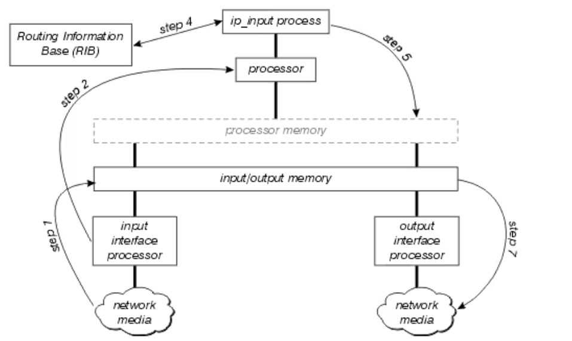
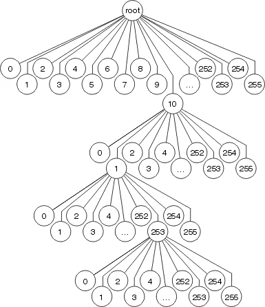
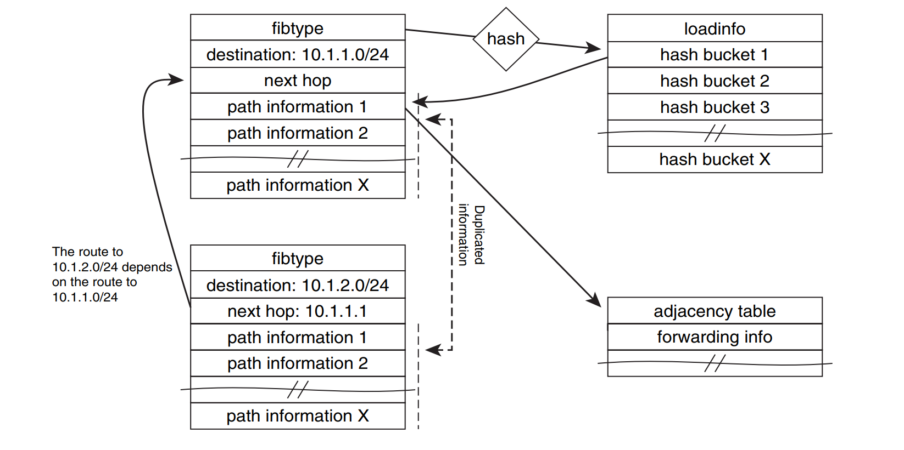

# 从快慢表到分层转发：ASIC + VPP 混合数据面的设计

> 这一篇是 [FM10K烹饪指南——把你的UIO挪到PCIE侧](https://blog.lenxy.net/FM10K-Fix-Your-UIO.html)的后续文章，因为可以挪到PCIE侧我才开始考虑的是否能把它打造成一款真正的路由器。而不是一个CRS。关于代码部分会在 [Netlab-OS](https://github.com/netlab-switch/netlab-os)的仓库里。

一台路由器收到一个数据包之后，最直观的做法似乎很简单：查路由表、找到下一跳、改写二层头，然后把它发送出去。

但当流量从几千 PPS 增长到几千万甚至数亿 PPS 时，这套看似简单的流程就开始变得昂贵。于是，路由器的发展史在很大程度上变成了一场关于 **“如何让绝大多数数据包走得更快”** 的工程实践。

从早期 Cisco IOS 的 Process Switching，到 Fast Switching 的 Route Cache，再到 CEF 将路由状态预先转换为 FIB；从分布式 Line Card 转发，到今天使用 ASIC、NPU 和软件数据面的混合架构，**Fast Path 与 Slow Path** 几乎贯穿了整个高性能路由器的发展过程。

然而，当现代 ASIC 的硬件表项容量远小于完整 Internet FIB 时，一个新的问题出现了：

> 如果软件能够维护完整的 Forwarding State，而 ASIC 只能容纳其中一部分，我们是否真的还需要维护传统意义上的“快表”和“慢表”？

本文尝试从这个问题出发，重新审视传统的快慢路径设计，并讨论一种不同的思路：

```
VPP Full FIB
      │
      │  Authoritative Forwarding State
      ▼
Offload Manager
      │
      ▼
ASIC Hardware Cache

ASIC HIT → Hardware Forwarding
ASIC /0  → VPP Software Forwarding
```

在这种架构中，ASIC 不再被视为另一份必须与软件严格同步的完整 FIB，而只是完整软件 FIB 之上的一个 **Hardware Acceleration Layer**。

换句话说，我们真正需要维护的也许从来都不是：

**两张 FIB**  而是：**One FIB, Two Forwarding Tiers.**

一份权威的 Forwarding State，两种不同性能等级的数据路径。

要理解为什么这种设计成立，我们首先需要回到几十年前，看看传统的 Fast Path 与 Slow Path 为什么会出现，以及 Cisco CEF 是如何改变路由器 Forwarding Architecture 的。

## 为什么传统快路径 / 慢路径存在：从 Process Switching 到 CEF

如今当我们谈到路由器的数据平面，我们会提到以下几个概念

- Fast Path / Slow Path
- Hardware FIB / Software FIB
- ASIC Forwarding / CPU Forwarding
- Fast Table / Slow Table

这些概念看起来像是现代 ASIC 路由器才有的设计，但实际上它们背后的问题非常古老：

**路由器如何避免为每一个数据包重复执行昂贵的路由决策？**

我们引入老牌网络厂商~~Disco~~ Cisco的技术路线，来理解这个问题：

```
Process Switching
        ↓
Fast Switching
        ↓
Cisco Express Forwarding
        ↓
Distributed CEF
        ↓
Hardware Forwarding
```

今天我们所说的 ASIC FIB、硬件 Offload，甚至本文后面要讨论的 **ASIC + VPP 分层转发**，本质上都可以从这条技术路线继续推导出来。

### Process Switching：最原始的方式

这也就是最直观的路由处理方式，把每一个 Packet，都做一次完整的处理。

收到一个 IPv4 Packet：

```
                  Packet
                     │
                     ▼
              Routing Table
                     │
             Longest Prefix Match
                     │
                     ▼
                 Next-Hop
                     │
                     ▼
                 ARP Table
                     │
                     ▼
              L2 Header Rewrite
                     │
                     ▼
                   TX
```

这种模式最大的特点就是：**Packet-driven forwarding decision**

一个包来了，CPU 才为包做 forwarding work。并不意味着 routing table 本身一定很慢，而是意味着：**大量本可以重复利用的 forwarding decision 被一遍又一遍执行。**即使一次 forwarding decision 只消耗很少的 CPU Cycle，乘以巨大的 PPS 后也会迅速成为瓶颈。

因此，第一个优化思路自然出现了：

> 上一个 Packet 已经查过这条路径了，为什么下一个 Packet 还要重新查？

### Fast Switching：第一次出现真正意义上的“快路径”

Cisco 后来引入了 **Fast Switching**。

> 在快速交换时，CPU 做出中断级转发决策。从路由表派生的信息及关于流出接口的封装信息共同结合，一起创建快速交换的高速缓冲。高速缓冲的每个条目都包括目标 IP 地址、传出接口标识和 MAC 重写信息。快速交换缓存采用二叉树结构。
>
> 如果快速交换的速缓存中没有某一个目的地条目，那么当前的信息包必须排队等候流程交换。当适当的流程为此信息包做出转发决策时，它在快速交换的高速缓冲中创建一个条目，并且可以在同一中断级别转发所有到达目的地的连续信息包。
>
> 因为这是一个基于目标的高速缓存，所以负载共享只按目标完成。即使路由表能为目标网络提供两个相等开销的路径，每个主机的快速交换高速缓存也只能拥有一个条目。

它的核心思想非常像我们今天熟悉的 Cache：

```
First Packet
     │
     ▼
Process Switching
     │
     ├── Routing Lookup
     ├── Next-Hop
     ├── L2 Rewrite
     │
     ▼
Create Route Cache
     │
     ▼
Subsequent Packets
     │
     ▼
Route Cache HIT
     │
     ▼
Fast Forward
```

Cisco 官方文档把 Fast Switching 描述为一种 **on-demand route cache**：接口收到数据包后，fast-switching code 会检查缓存中是否已经存在此前数据包构建好的 forwarding information；如果存在，就可以直接向目标接口发送。

于是第一次出现了非常明显的：

```
               Packet
                  │
                  ▼
             Route Cache?
               /      \
             HIT      MISS
              │         │
              ▼         ▼
         Fast Path   Process Path
              │         │
              │      Full Lookup
              │         │
              │      Build Cache
              │         │
              └────┬────┘
                   ▼
                  TX
```

这已经非常接近今天工程师口中的：

**快路径 / 慢路径。**

当然Cisco的工程师也为更高级的产品线推出了**最佳交换**

> 最佳交换除了使用 256 路多维树 (mtree) 而不是二叉树外，与快速交换基本相同，因而需要更大的内存和更快的高速缓存查找。



每个八位组都用于确定在树的每一层中选择 256 个分支中的哪一个，这意味着查找任何目的地最多涉及 4 次查找。对于较短的前缀长度，可能只需要 1 至 3 次查找。MAC 标头重写信息和输出接口信息作为树节点的一部分进行存储，因此缓存失效和老化仍会像快速交换中一样发生。

### 为什么 Fast Switching 最终仍然不够好？

Route Cache 看起来很完美：

```
慢路径负责学习
      ↓
快路径负责转发
```

但它存在一个根本问题：**Cache 是 Traffic-driven，而不是 Routing-driven。**

正如Cisco的文档中所提到的

> 1. 特定目标的第一个数据包总是经过进程交换以初始化快速高速缓存。
> 2. 快速高速缓存可变得非常大。例如，如果有多条相等成本的路径通往同一个目的地网络，那么如上所述，快速缓存由主机条目组装而不是网络组装。
> 3. 快速高速缓存和 ARP 表之间没有直接关系。如果 ARP 高速缓存的条目变得无效，则无法使其在快速高速缓存里无效。要避免此问题， 1/20th缓存每分钟随机地无效。高速缓存的这种无效/重新填充可能会成为具有非常大的网络的 CPU 密集型高速缓存。

假设路由器有：1,000,000 routes 但是刚刚启动：

```
Route Cache = Empty
```

第一个去往：8.8.8.8的数据包需要走慢路径,第一个去往：1.1.1.1的数据包也需要走慢路径。

如果互联网流量访问大量不同 Destination：

```
Dst A → cache miss
Dst B → cache miss
Dst C → cache miss
Dst D → cache miss
...
```

CPU 仍然会不断参与 forwarding。更何况在动态网络中，路由变化会频繁使 fast-switching cache 失效，这可能导致流量重新回退到 process switching。

于是 Cisco 做了一件非常重要的事情：

> **既然 Routing Table 已经知道所有 Route，为什么还要等第一个 Packet 到来之后才建立 Fast Entry？**

CEF 就由此产生。

### CEF：从 Reactive Cache 变成 Proactive FIB

CEF：**Cisco Express Forwarding**最核心的改变其实非常简单。

Fast Switching：

```
Packet arrives
      ↓
Lookup Route
      ↓
Generate Cache Entry
```

CEF：

```
Routing Table Changes
      ↓
Generate Forwarding Entry
      ↓
Packet arrives
      ↓
Direct Lookup
```

也就是说：**Forwarding State 从 Traffic-driven 变成了 Control-plane-driven。**

CEF 不再等待流量触发 Cache。而是提前根据 Routing Table 路由表构建：**FIB — Forwarding Information Base**

于是架构变成：

```
                 Routing Protocol
              BGP / OSPF / IS-IS
                       │
                       ▼
                      RIB
               Routing Information
                       │
                       ▼
                      FIB
              Forwarding Information
                       │
                       ▼
                    Packet
                       │
                       ▼
                     LPM
                       │
                       ▼
                   Next-Hop
```

### CEF 不只有 FIB，还有 Adjacency Table

仅仅知道：

```
8.8.8.0/24 → Next-Hop 10.0.0.2
```

其实还不能直接把 Ethernet Frame 发出去。

还需要知道：

```
Dst MAC
Src MAC
Interface
VLAN
Encapsulation
```

所以 CEF 又维护一个非常重要的数据结构：**Adjacency Table**

Cisco 将 CEF 的两个主要组成部分定义为： FIB + Adjacency Table

其中 FIB 用于 destination-prefix forwarding decision，而 adjacency table 保存对应下一跳所需的 Layer 2 forwarding/rewrite information。



Cisco 甚至会预先计算并保存相邻节点的 link-layer header rewrite，以便后续 CEF forwarding 直接使用。

### Distributed CEF：快路径开始离开主 CPU

CEF 还有一个非常重要的演进：

**dCEF — Distributed Cisco Express Forwarding**

Central CEF 中：

```
Line Card
    │
    ▼
Route Processor
    │
    ├─ FIB
    ├─ Adjacency
    └─ Forwarding
```

仍然存在一个中心处理点。当 Router 的接口数量和总带宽继续增加时，所有 Packet 都送给 Route Processor 显然很难线性扩展。

因此 dCEF 把 FIB 和 adjacency information 分发到了 Line Card。

```
                    Route Processor
                         RIB
                          │
                  FIB Distribution
                 ┌────────┼────────┐
                 │        │        │
                 ▼        ▼        ▼
              LC #1     LC #2     LC #3
               FIB       FIB       FIB
                │         │         │
                ▼         ▼         ▼
           Forwarding Forwarding Forwarding
```

Cisco 官方描述 dCEF 时指出：line card 会维护 FIB 和 adjacency table 的副本，并直接完成 express forwarding，从而让 Route Processor 不再参与正常 packet switching；RP 与 line card 之间通过 IPC 同步这些 forwarding tables。

在这里，已经非常的接近现代架构了。

控制面负责生成 Forwarding State，而真正的数据包已经可以完全不经过主 CPU。

```
Control Plane CPU
        │
        ▼
ASIC FIB
        │
        ▼
Hardware Forwarding
```

那如果我们更进一步，Line Card 上的软件 forwarding engine 从 **CPU / forwarding processor**  换成 **ASIC / NPU**

架构自然就变成：

```
                    Routing Protocols
                          │
                          ▼
                         RIB
                          │
                          ▼
                         FIB
                          │
                     Programming
                          │
                          ▼
                    ASIC HW FIB
                          │
                          ▼
                       Packet
                          │
                          ▼
                     ASIC Lookup
                          │
                          ▼
                    Wire-Speed TX
```

现代硬件路由器的基本思想，到这里已经非常清晰。

实际上，在今天的 Cisco IOS XR 文档里，CEF 仍然被描述为维护 forwarding table 与 adjacency information，并服务于 software 和 hardware forwarding engines 的基础 forwarding infrastructure。

### 那么“快路径 / 慢路径”到底是什么？

首先需要特别强调：**Slow Path 并不等于 Slow FIB。**很多情况下根本不存在所谓独立的“慢表”。

绝大多数数据包都是直接通过 FIB 转发。

只有：

```
TTL Expired
ARP / ND
Local Destination
IP Options
Unsupported Feature
Control Plane Traffic
Exception
```

等情况才 punt → CPU。CEF 本身就存在类似的 `punt adjacency`：需要特殊处理、或者当前 CEF switching path 不支持的数据包，可以交给更高一级的 switching level 处理。

所以真正意义上的：Fast Path / Slow Path 更接近：

```
                 Forwarding

              ┌──────┴──────┐
              │             │
          Common Case   Exceptional Case
              │             │
              ▼             ▼
          Fast Path      Slow Path
```

这背后其实是一条非常普遍的计算机体系结构原则：**Optimize the common case.**

正常数据流量走极端优化的路径，复杂情况交给功能更完整、但性能较低的软件处理。

当 ASIC 出现以后，又产生了一个新的资源限制：

```
Software Memory
→ GB
ASIC SRAM / TCAM
→ Expensive & Limited
```

CPU 软件 FIB 也许可以容纳：10M 20M routes，但 ASIC HW FIB 未必可以。

于是新的问题出现：

```
                Full FIB
                  1M
                   │
            ┌──────┴──────┐
            │             │
      Hardware FIB   Software FIB
          100K            1M
            │             │
            ▼             ▼
          ASIC            CPU
```

这才逐渐形成我们今天口语中所说的：快表 + 慢表，但从 CEF 的历史来看就会发现：“快慢表”其实不是根本设计目标，它只是不同 forwarding resource 性能与容量不对称之后产生的一种实现方式。

真正不变的核心问题始终是：

**如何让绝大多数 Packet 使用最低成本完成 Forwarding。**

## Partial L3 Offload 问题：为什么我们不需要两份完整 FIB

上一章从 Cisco 的 Process Switching、Fast Switching 一直讲到了 CEF。

这条演进路线实际上解决了一个非常明确的问题：**不要让数据包参与路由决策，而应该提前把 Routing State 转换成 Forwarding State。**

于是现代路由器逐渐形成：

```
Routing Protocol
      │
      ▼
     RIB
      │
      ▼
     FIB
      │
      ▼
Forwarding Engine
```

问题在于，当 Forwarding Engine 从 CPU 变成 ASIC 后，又出现了一个新的矛盾：

**软件可以保存完整 Internet FIB，但 ASIC 的高速表项资源是有限的。**这也是 Partial L3 Offload 出现的根本原因。

### ASIC 为什么不能简单保存所有 Route？

从软件角度看，一张包含百万级 Prefix 的 IPv4 FIB 并不是什么特别困难的问题。

普通 x86 系统拥有足够大的DRAM。VPP 本身也明确区分了用于表示完整路由状态的数据结构和真正供 dataplane lookup 使用的 forwarding representation；它的 FIB 就是数据面执行 LPM 的基础。

但是 ASIC 面临的资源环境完全不同。Hardware Forwarding 希望做到：

```
Packet
   │
   ▼
Parser
   │
   ▼
LPM Lookup
   │
   ▼
Adjacency
   │
   ▼
Rewrite
   │
   ▼
Egress
```

而整个过程必须在极短且确定的 pipeline latency 内完成。

因此 ASIC 使用的并不是廉价、大容量、延迟相对较高的系统 DRAM，而通常是：

SRAM 

TCAM 

On-chip lookup structures 

External lookup memory

这些资源的共同特点是：Fast + Deterministic + Expensive + Limited

### 当 Full FIB 装不进去时怎么办？

最直接的办法当然是：能装多少，装多少。于是产生：**Partial L3 Hardware Offload**

例如：

```
Software FIB

0.0.0.0/0
1.0.0.0/24
1.0.4.0/22
1.1.1.0/24
2.16.0.0/13
...
                ~1M routes
```

ASIC 只能容纳其中一部分：

```
Hardware FIB

1.0.0.0/24
1.1.1.0/24
8.8.8.0/24
...
                ~100K routes
```

剩余 Route 交给 CPU：

```
                     Packet
                        │
                        ▼
                      ASIC
                    LPM Lookup
                    /        \
                  HIT        CPU
                   │          │
                   ▼          ▼
                HW Path    SW Path
```

MikroTik 当前的 L3HW 实现就是一个非常直观的现实例子。

> 当整个路由表无法装入硬件内存，较短的前缀会被重定向到 CPU，因此理论上无需尝试卸载比 SHWP 更短的路由前缀，因为这些前缀最终也会被重定向到 CPU。不过，对路由表的重大更改可能会导致不同的索引布局，从而改变可进行硬件卸载的路由数量。因此，建议定期对整个路由表重新建立索引。

例如：

```
/32 ─┐
/31  │
/30  │
...  ├── ASIC
/24  │
/23 ─┘

/22 ─┐
/21  │
...  ├── CPU
/8   │
/0  ─┘
```

从工程角度看，这是完全合理的。因为 Longest Prefix Match 天然提供了一种分层机制。

### 真正的问题并不是“快表太小”

如果只看 dataplane，会觉得这个问题已经解决：

ASIC 能处理 → ASIC ASIC 处理不了 → CPU。但真正复杂的部分其实发生在 **Control Plane 与 HAL**。

假设系统学习到一条： 203.0.113.0/24  via 10.0.0.1

首先它进入 RIB：

```
BGP
 │
 ▼
RIB
 │
 ▼
Best Path 选择后：
 │
 ▼
Software FIB
```

如果系统支持 Hardware Offload：

```
Software FIB
     │
     ▼
Offload Manager
     │
     ▼
ASIC Driver
     │
     ▼
ASIC FIB
```

到这里问题已经发生变化。

我们不再只是维护：route exists 而是在维护：

```
route exists in software
+
route should exist in hardware
+
route was successfully programmed
+
route still exists in hardware
```

一条 Route 开始拥有多个状态。

### 一条 Route，不再只有一个状态

一个比较真实的状态模型可能变成：

```
203.0.113.0/24
RIB: active
Software FIB: installed
Hardware candidate: yes
ASIC programming: requested
ASIC state: installed
```

正常的时候当然没有问题。

但如果 ASIC Table 满了：

```
ASIC programming: failed
reason: table full
```

那么：

```
RIB              = valid
Software FIB     = valid
Hardware desired = yes
Hardware actual  = no
```

这时候必须确保：

```
Packet
   │
   ▼
Software Path
```

仍然可以正确转发。

于是原本非常简单的：Prefix → Nexthop

逐渐演变成：

```
Prefix
  │
  ├── control-plane state
  ├── software forwarding state
  ├── hardware eligibility
  ├── desired hardware state
  ├── programmed hardware state
  ├── actual hardware state
  └── fallback behavior
```

复杂度已经不再来自 Routing。

而来自：

> **State Synchronization**

### 所以问题并不是“两张真正独立的完整 FIB”

这里需要避免一个过度简化。现代 Partial Offload 系统通常并不会真的傻到维护：Complete SW FIB + Complete HW FIB，然后要求两张表逐条完全一致。

更常见的实际模型应该是：

```
                 RIB
                  │
                  ▼
           Software FIB
           Authoritative
                  │
                  ▼
          Offload Selection
                  │
                  ▼
          Hardware Subset
```

也就是说，Hardware FIB 本来就可能只是 Software FIB 的子集。

真正值得讨论的问题不是：为什么保存了两份 Route？而是：**为什么我们让 Hardware State 成为了一个需要长期维护一致性的第二 Forwarding State？**区别非常重要。

### 那为什么不让 Software FIB 永远是唯一权威？

假设我们反过来设计。系统从一开始就定义： VPP Full FIB = Authoritative Forwarding State

例如：

```
VPP

0.0.0.0/0
1.0.0.0/24
1.1.1.0/24
8.8.8.0/24
203.0.113.0/24
...
```

所有正常 Route 无论是否进入 ASIC，都必须存在于 VPP。

然后：

```
                  VPP FIB
                Full / Correct
                     │
                     ▼
              Offload Manager
                     │
            Select valuable routes
                     │
                     ▼
                 ASIC FIB
                   Subset
```

于是 ASIC 的定义发生变化。

它不再是：Hardware copy of forwarding state

而变成：Hardware acceleration subset

这两个定义看起来很接近，实际上架构意义完全不同。

传统 Hardware Offload Manager 的思维容易变成：

```
Software State
      │
      │ synchronize
      ▼
Hardware State
```

于是它关注：

```
sync/retry/reconcile/rollback/consistency
```

而 Hardware Cache 模型关注的是：

```
                  VPP
                   │
                   ▼
            Candidate Routes
                   │
                   ▼
              Selection
                   │
                   ▼
             ASIC Cache
```

### `/0` 恰好给了我们一种天然的 Fallback

IP Routing 有一个非常有趣的性质：

**Longest Prefix Match**

假设 ASIC 中存在：

```
8.8.8.0/24   → Port 1
1.1.1.0/24   → Port 2
203.0.113/24 → Port 3

0.0.0.0/0    → VPP
```

那么：

```
Dst = 8.8.8.8
```

匹配：8.8.8.0/24 直接 Hardware Forward。

而： Dst = 9.9.9.9 ASIC 中没有对应更长 Prefix。最终自然匹配：0.0.0.0/0 于是进入：VPP

整个过程甚至不需要一个特殊意义上的：FIB MISS逻辑。

而是：

```
                         ASIC LPM

                           Packet
                              │
                              ▼
                         Prefix Lookup
                         /           \
                specific hit          /0
                    │                  │
                    ▼                  ▼
                HW Forward           VPP
```

值得注意的是，MikroTik 当前的 Partial L3HW 文档本身也体现了类似的 LPM 分层思想：当完整表无法进入硬件时，更长 Prefix 可以驻留在硬件，而更短 Prefix 由 CPU 处理。

我们只是把这个思想进一步推到底：

**为什么不直接让最短的那个 Prefix——**`/0`**成为 Software Forwarding 的入口？**

### “长前缀优先”只是最简单的 Cache Policy

最简单的选择策略当然是：

```
/32
 ↓
/31
 ↓
/30
 ↓
...
 ↓
/24
 ↓
...
```

一直填满 ASIC。这样有一个非常漂亮的数学性质：由于 LPM：

```
Specific Route > Default Route
```

所以 Hardware Route 永远优先于：/0 → VPP实现非常简单。

但这并不意味着：Longest Prefix = Most Valuable Prefix

例如：

```
Route A
192.0.2.1/32
10 pps
```

和：

```
Route B
8.8.8.0/24
2,000,000 pps
```

如果 ASIC 只剩一个表项：/32，并不一定比：/24 更值得 Offload。

因此更合理的策略最终可能是：

```
Offload Score =
    Prefix Value
  + PPS Weight
  + BPS Weight
  + Operator Priority
  + Stability
```

于是：

```
Software FIB
      │
      ▼
Telemetry
      │
      ▼
Policy Engine
      │
      ▼
Hot Route Set
      │
      ▼
    ASIC
```

这也是把 ASIC 定义为 Cache 后带来的另一个好处：

> 我们终于可以讨论 Cache Replacement Policy，而不是纠结 Hardware FIB 是否完整。

### VPP 本身非常适合承担 Authoritative Software FIB

这里选择 VPP 并不仅仅因为它“比 Linux 快”。

VPP 的 FIB 架构本身就是围绕 dataplane forwarding 构建的。

官方文档明确将 FIB 描述为数据面用于执行 LPM 的 forwarding database，并且内部区分控制面表达与真正提供给 dataplane 的 forwarding objects。

因此从整个系统看：

```
BGP / OSPF / IS-IS
        │
        ▼
       RIB
        │
        ▼
       VPP
        │
        ▼
Full Software Forwarding
```

本身就已经是一台完整的软件 Router。

ASIC 的加入只是：

```
            VPP Router
                │
                ▼
      Hardware Acceleration
```

而不是：VPP Router + ASIC Router

这个区别非常关键。

### One FIB, Two Forwarding Tiers

因此我更愿意把整个架构定义成：

```
               One Authoritative FIB
                       │
                       ▼
                      VPP
                       │
           ┌───────────┴───────────┐
           │                       │
           ▼                       ▼
      Hardware Tier          Software Tier
          ASIC                    VPP
           │                       │
           └──────────┬────────────┘
                      │
                      ▼
                  Forwarding
```

而不是：Fast FIB + Slow FIB

也不是：Hardware Router + Software Router

而是：**One FIB, Two Forwarding Tiers.** 一个 Forwarding Truth。两个性能等级。
