# FM10K硬件指南——探索FM10420与FM10840

> 本文章适用于基于Intel FM10840的Silicom PE31625G24DIRA 和基于Intel FM10420的PE3100G2DQIR 
>
> 这是一篇学习笔记，大部分内容都是AI生成整理。只为了解FM10K及更早先的架构设计。

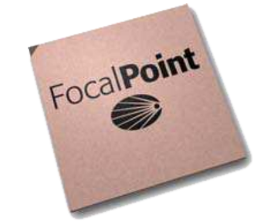

## 关于Intel FM10K

2011年，intel收购了Microsystems  一家设计数据中心的 10GbE/40GbE Ethernet switch silicon。

重点优势包括高性能、低延迟和 workload balancing。在SDK中我们能看到FM2000-FM4000-FM6000的身影，当然这些只是Fulcrum 的前序作品。但是不得不承认，在FM6K之前这个芯片是一个正儿八经的Switch Chip，而不是在FM10K后变成了把 Ethernet switch fabric、PCIe host interfaces 和 Intel NIC datapath 融合在了一颗芯片里。

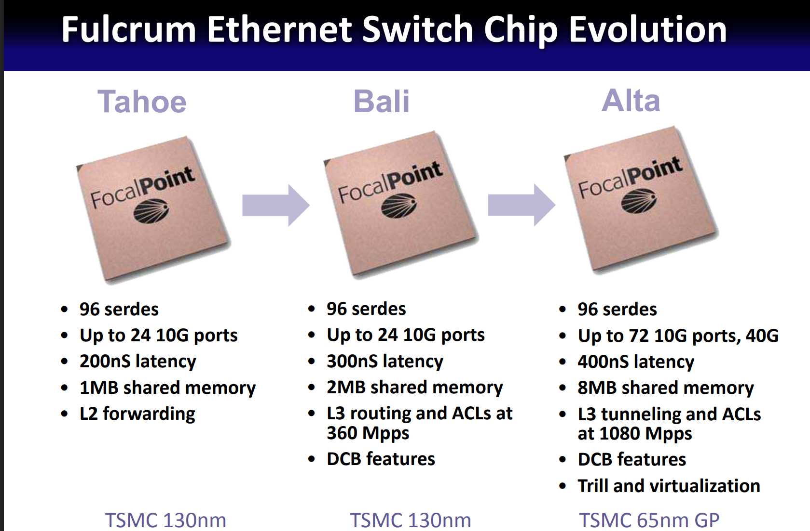

### QDI / Asynchronous Architecture ：Fulcrum 的异步交换芯片哲学

在研究 Fulcrum FM2000、FM4000、FM6000，乃至后来的 Intel FM10000 时，一个很难绕开的关键词就是：

**QDI — Quasi-Delay-Insensitive Asynchronous Design**

这不是一个普通的低功耗优化，也不仅仅是一种不同的 Clock Domain 设计方式。对于 Fulcrum 来说，**异步电路几乎是整个公司最核心的技术资产之一**。

#### 从 Clock 开始：同步电路是如何工作的？

传统数字 ASIC 大部分采用 **Synchronous Design**。

最简单的流水线可以抽象成：

```
flowchart LR
    A["Register A"] --> L1["Logic"]
    L1 --> B["Register B"]
    B --> L2["Logic"]
    L2 --> C["Register C"]

    CLK["Global Clock"] -.-> A
    CLK -.-> B
    CLK -.-> C
```

所有 Pipeline Stage 都由一个时钟系统统一推进：

```
Clock Edge
    ↓
Register 输出数据
    ↓
Combinational Logic 运算
    ↓
结果必须在下一个 Clock Edge 前稳定
    ↓
Next Register 捕获
```

因此一个同步 Pipeline 的 Clock Period 必须满足一个非常重要的条件：

```
Tclock ≥ Tworst_case
```

换句话说：

> **整个系统必须按照最慢的那个合法路径来设计时钟周期。**

即使某一批数据实际只用了 400 ps 就完成计算，只要设计的 worst-case path 是 1 ns，这一级通常仍然要等到下一个 Clock Edge 才能继续。

同步 ASIC 因此需要处理 Clock Tree、Clock Skew、Setup/Hold Timing、Process/Voltage/Temperature variation 等大量时序问题。

#### Asynchronous Pipeline：不再等待 Clock

异步 Pipeline 的思路完全不同。

它没有要求每一级数据处理都等待同一个全局 Clock Edge，而是让相邻 Stage 之间通过 **Handshake** 协调。

可以把它简化成：

```
sequenceDiagram
    participant A as Stage A
    participant B as Stage B
    participant C as Stage C

    A->>B: Data + Request
    B->>A: Acknowledge

    B->>C: Data + Request
    C->>B: Acknowledge
```

逻辑上的意义是：

```
Stage A
   │
   │ 数据已经准备好
   ▼
Stage B
   │
   │ 我已经处理完成
   ▼
Stage C
```

不再需要：

```
Wait...
Wait...
Clock Edge!
```

而是：

```
Finished?
   │
  YES
   ↓
Continue immediately
```

Caltech 对 QDI asynchronous circuits 的研究将这种设计建立在 handshake protocol、completion detection 和 delay-insensitive communication 等机制之上；QDI 电路只保留非常有限的 timing assumption，而不是依赖传统意义上的全局 Clock 来决定每一级何时完成。

#### QDI 中的关键思想：Completion Detection

这里才开始真正有意思。

同步电路隐含假设：

```
经过 1 ns
    ↓
计算应该完成了
```

QDI 的思路则是：

```
不要猜什么时候完成。
让数据自己告诉你：
“我已经完成了。”
```

因此典型的 QDI pipeline 会具有 **Completion Detection**：

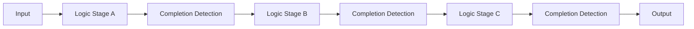

只有当前 Stage 的输出被确认有效以后，Handshake 才允许后一级继续处理。

Fulcrum 在 Hot Chips 对自己的 Self-Timed Domino Logic Pipeline 描述中，正是把：

```
Dual-Rail Domino Logic
        +
Completion Detection
        +
Handshake Control
```

组合在一起。Fulcrum 当时声称，这种实现相对于传统 static logic + flip-flop pipeline 可以显著降低 pipeline latency，同时避免大量无意义的 clock-driven switching。

#### Self-Timed Pipeline

把这些东西组合起来以后，一个 Fulcrum 风格的异步流水线可以简化为：

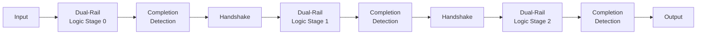

它与同步流水线最本质的差异，可以总结成：

|                   | Synchronous Pipeline     | QDI Asynchronous Pipeline                         |
| ----------------- | ------------------------ | ------------------------------------------------- |
| Pipeline 推进     | Clock Edge               | Handshake                                         |
| 完成判断          | 等待预定 Clock Period    | Completion Detection                              |
| Timing            | Worst-case timing        | Data-dependent completion                         |
| 控制基础          | Global/Regional Clock    | Local handshake                                   |
| Pipeline Register | Flip-Flop/Register       | Async pipeline / handshake state                  |
| Activity          | Clock 持续运行           | 数据到来才驱动处理                                |
| PVT 适应          | Timing closure 留 Margin | Completion mechanism 自然适应部分 delay variation |

但这里要避免一个常见误解：

> **Asynchronous 并不意味着“电路没有时间概念”。**

相反，它对数据依赖、handshake、completion、fork timing 和物理实现仍然有非常严格的要求，只是不再使用传统 synchronous design 那种统一的 clock period 来协调所有计算。严格意义上的 QDI 也并非完全不做任何 timing assumption；例如经典 QDI 模型通常仍依赖有限的 isochronic-fork assumption。

#### 为什么这套东西特别适合 Ethernet Switch ASIC？

这就涉及 Fulcrum 为什么愿意为这种非常复杂的设计方法投入如此多工程资源。

交换 ASIC 中大量高速数据结构恰好包括：

```
Crossbar
TCAM
SRAM
Scheduler
FIFO
Packet Pipeline
```

而这些结构往往具有一个共同特点：

> **数据流非常规则，但吞吐量和延迟要求极高。**

Fulcrum 在 Hot Chips 中明确指出，它认为 QDI 特别适合：

- Crossbar
- TCAM
- SRAM

并将高吞吐、低延迟、功耗效率以及对 manufacturing / operational variation 的鲁棒性列为主要优势。

这几乎正好对应 Ethernet Switch 的核心。

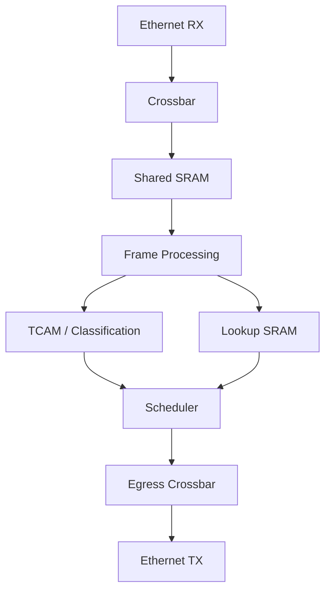

换句话说：

Fulcrum 并不是为了“异步而异步”。它找到的是一种非常适合 **高速交换数据通路** 的异步计算模型。

### RapidArray™ Shared-Memory Architecture：共享内存交换架构

如果说 QDI 是 Fulcrum 在 **circuit level** 上最具代表性的技术，那么：

**RapidArray™**

就是这套设计哲学在 **switch architecture level** 上最直接的体现。

Intel 后来的 FM5000/FM6000 Datasheet 对 RapidArray 给出了一个非常明确的定义：

> **Single-output-queued shared-memory architecture**

而且明确指出，这套架构从 **FM2000、FM4000 一直延续到 FM5000/FM6000**。

从架构上看，RapidArray 并不是简单的：

```
Port
 ↓
Crossbar
 ↓
Port
```

而是一套完整的：

```
Ingress
    ↓
Crossbar
    ↓
Shared Packet Memory
    ↓
Scheduler
    ↓
Crossbar
    ↓
Egress
```

系统。

这也是为什么只看 Fulcrum 芯片的 Ethernet Port 数量，很容易低估它真正有意思的地方。

#### 从 Packet 的角度看 RapidArray

在 FM5000/FM6000 中，一个 Packet 进入 ASIC 后，大致会经历：

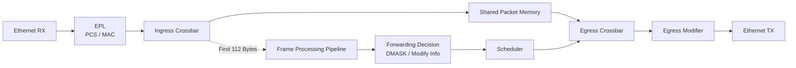

这个图里其实存在两条相互配合、但非常不同的数据路径：

```
Packet Payload
     │
     └──→ Shared Memory

Packet Header
     │
     └──→ Frame Processing Pipeline
```

也就是说：

> **大块 Packet Data 和 Forwarding Decision 并不需要沿着同一条流水线传播。**

FM6000 的 Ingress Crossbar 将 Packet 按 **160-byte segment** 写入 Shared Memory，而第一个 segment 的前 **112 bytes** 会同时被送往 Frame Handler，用于 switching、routing 和 classification。

这种分离非常重要。

因为交换芯片真正需要高速分析的通常只是：

```
Ethernet Header
VLAN
MPLS
IPv4 / IPv6
TCP / UDP
Tunnel Header
Metadata
```

没有必要让一个 1500-byte Packet 的所有内容全部穿过复杂的 TCAM / Lookup Pipeline。

因此：

```
Payload → Memory

Header → Intelligence
```

这可以看作 RapidArray 与 FlexPipe 之间最基础的分工。

#### Ingress Crossbar

当 Packet 从 Ethernet Port 进入时，首先经过：

**Ingress Crossbar**

FM6000 的 Ingress Crossbar 会把连续的 Ethernet stream 转换成 **160-byte segments**，然后写入中央 Packet Memory。

FM5000/FM6000 的 Ingress / Egress Crossbar 最多支持 **76 个 full-duplex logical channels**；每个 channel 可以提供 10GbE throughput，40GbE 则由四个 channel 组合，整个 switch fabric 的 aggregate bandwidth 为 **720GbE**。

可以简化理解为：

```
flowchart LR
    P0["Port 0"] --> X["Ingress Crossbar"]
    P1["Port 1"] --> X
    P2["Port 2"] --> X
    P3["Port 3"] --> X
    PN["..."] --> X

    X --> M0["Memory Segment"]
    X --> M1["Memory Segment"]
    X --> M2["Memory Segment"]
    X --> M3["Memory Segment"]
```

Crossbar 的作用并不是决定 Packet 最终应该去哪。

它解决的是另一个问题：

> **如何让大量高速 Port 同时访问中央 Memory。**

至于：

> **Packet 最终应该从哪个 Port 发出去？**

这是 Frame Processing Pipeline 与 Scheduler 的工作。

#### Shared Memory：所有 Port 共用一个 Buffer Pool

RapidArray 的核心是：

**Shared Memory**

FM6000 的 Main Packet Memory 为 **7.5 MB**，如果把其他功能模块中的 Packet/Header Memory 一并计算，总量大约为 **9.5 MB**。

但真正重要的并不是数字，而是：

> **这些 Buffer 并不是简单静态绑定给某个 Ethernet Port。**

Intel 在 Datasheet 中直接描述 FM5000/FM6000：

> **fundamentally is a shared memory switch**

中央 Frame Memory 可以被所有 Port 使用。

概念上可以理解成：

**Static Per-Port Buffer**

```
Port 1   ██████████

Port 2   ██

Port 3

Port 4   █
```

如果 Port 1 已经塞满：

```
Port 1 → DROP
```

即使：

```
Port 3 Buffer = Empty
Port 4 Buffer = Empty
```

这些空间也未必能够拿来给 Port 1 使用。

RapidArray 的思想则更接近：

```
              Shared Buffer Pool
        ┌─────────────────────────┐
Port 1 ─┤████████████              │
Port 2 ─┤██                       │
Port 3 ─┤                         │
Port 4 ─┤█                        │
        └─────────────────────────┘
```

Buffer 不再首先属于某一个物理 Port，而是一项共享资源。

这意味着交换芯片能够根据实际 Traffic Pattern 更灵活地使用有限的 on-chip SRAM。

#### Packet 并不是作为一个连续大块存储

这里还有一个非常值得写的设计。

FM6000 将 Packet 切分成：

**160-byte segments**

例如一个约 1500-byte Ethernet frame，可以抽象成：

```
Frame
 │
 ├── Segment 0
 ├── Segment 1
 ├── Segment 2
 ├── Segment 3
 ├── Segment 4
 ├── Segment 5
 ├── Segment 6
 ├── Segment 7
 ├── Segment 8
 └── Segment 9
```

Scheduler 维护：

```
Free Segment List
Receive Queues
Transmit Queues
Segment Chains
```

Incoming packet 到达时，Scheduler 从 Free Segment Pool 分配 storage；Packet 完成 classification 后，再将相关 segment 信息放入对应的 transmission queue。

因此更准确的模型不是：

```
TX Queue
  ↓
[Whole Packet]
[Whole Packet]
[Whole Packet]
```

而是：

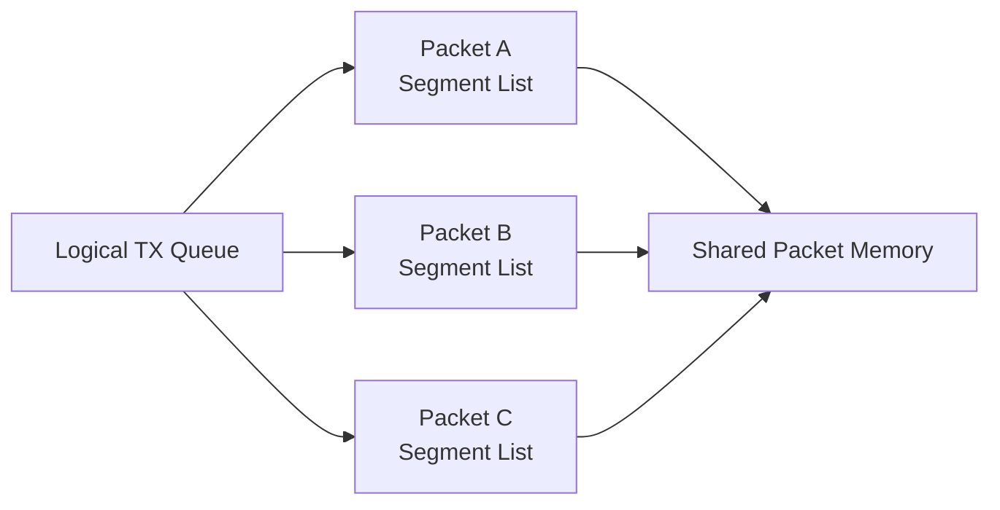

真正的大块 Packet Payload：

> **只存在中央 Shared Memory 中。**

Queue 更重要的是管理：

```
Which frame?
Which segments?
Which destination?
When can it transmit?
```

#### Single Output Queued 到底是什么意思？

Intel 对 RapidArray 的正式术语是：

**Single Output Queued Shared Memory Architecture**。

从 Forwarding Model 看，它可以理解为：

```
Ingress Port
     │
     ▼
Shared Memory
     │
     ▼
Logical Egress Queue
     │
     ▼
Scheduler
     │
     ▼
Egress Port
```

也就是说，Packet 真正需要等待的是：

> **它所对应的输出调度资源。**

而不是简单地被固定困在 ingress port 自己的 FIFO 中。

这对交换芯片非常重要，因为它避免了最简单 input FIFO 架构中容易遇到的：

**Head-of-Line Blocking**

问题。

例如：

```
Ingress Queue:

Packet A → Port 1 [Blocked]
Packet B → Port 2 [Free]
Packet C → Port 3 [Free]
```

一个简单 FIFO 可能因为：

```
Packet A cannot move
```

导致：

```
Packet B
Packet C
```

也一起被挡在后面。

而 Shared Memory + Output Scheduling 的思路，是把：

```
Where the frame is stored
```

与：

```
When the frame is transmitted
```

分离开。

#### Scheduler 才是 RapidArray 真正的大脑

Shared Memory 自己不会决定：

```
谁先发送？
```

这件事情由：

**Scheduler**

负责。

FM6000 Scheduler 管理：

- Free segment
- Receive queue
- Transmit queue
- Packet scheduling
- Segment list
- Traffic class
- Egress arbitration

并最终告诉 Egress Crossbar：

> **下一次应该从 Shared Memory 中读取哪些 Segment。**

Intel Datasheet 描述的流程大致是：

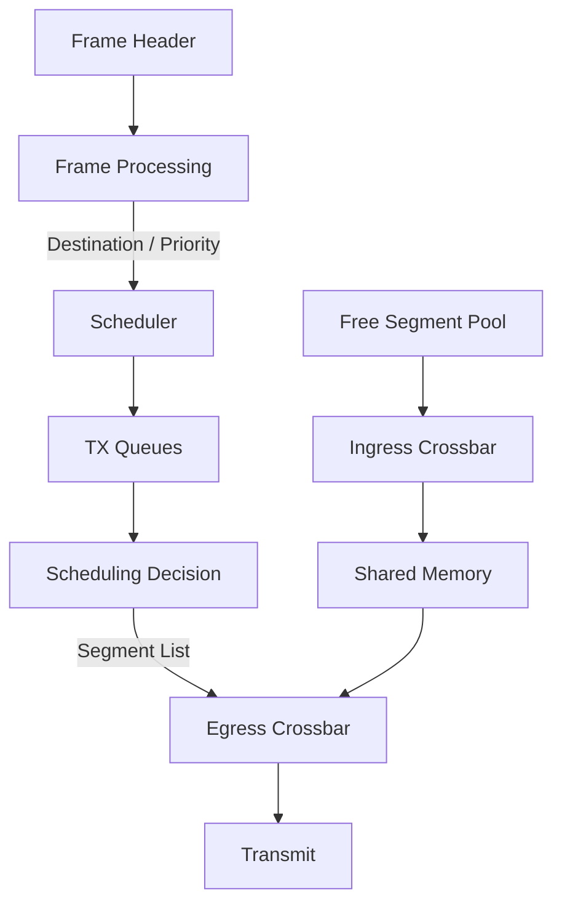

Scheduler 还需要同时处理数以千计的 queue/event。

Fulcrum 在 Hot Chips 23 对 Alta 的设计挑战中直接指出：

```
720G Switch / Scheduler

67 ns scheduling period
over 1000 queues

up to 150 MHz
per-queue event rate
```

并把它称为一个：

**very challenging asynchronous design problem**。

这就把上一章讨论的 QDI 真正连接到了 RapidArray。

### FlexPipe™ Packet Processing Pipeline：从固定功能交换到 Match-Action 数据平面

如果说 RapidArray™ 解决的是：

> **How does the packet move through the switch?**

那么 FlexPipe™ 解决的就是：

> **What should the switch do with the packet?**

对于今天熟悉 P4、PISA、programmable data plane 的工程师来说，`Match → Action → Metadata → Next Stage` 已经是一种相当自然的思维方式。

但在 FM6000 所处的 2010～2011 年，这种思想还远没有今天这么普遍。

Fulcrum 在设计 Alta / FM6000 时面对的问题，并不是简单增加几个 VLAN、ACL 或 Routing Feature，而是：

> **随着协议和功能不断增加，继续为每一种网络功能设计独立的硬编码逻辑模块，复杂度正在迅速失控。**

Hot Chips 23 中 Fulcrum 给 Alta 列出的需求已经包括：

```
L2 Switching
IPv4 / IPv6 Routing
IP Multicast
5-Tuple ACL
MPLS
TRILL
Q-in-Q
PBB / PBT
DCB
PFC
Congestion Notification
sFlow
Advanced Hashing
Pseudo-Random Load Balancing
Virtualization
Tunneling
```

而 Alta 最终甚至在 specification closure 之后，又通过 Pipeline Configurability 支持了 FCoE、Native Fibre Channel、IP-in-IP、IPv4/IPv6 Translation、GRE、NAT、VEPA、VN-Tag、VPWS/VPLS、LISP 和早期 OpenFlow 等功能。

这就是 FlexPipe 出现的背景。

#### 传统思路：为每一种功能造一个 Engine

一个典型的传统交换 ASIC，可以抽象成：

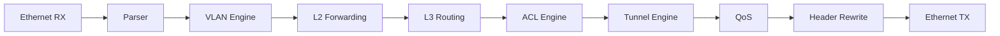

这种设计的优势非常明显：

- 每个模块针对特定功能优化；
- 行为容易预测；
- 功耗和面积相对容易控制；
- 软件 SDK 只需要配置预定义 Feature。

但是它也存在一个问题：

```
New Protocol
    ↓
Existing Engine cannot understand it
    ↓
Need New Logic
    ↓
New Silicon Revision
```

如果突然出现一种新的 encapsulation：

```
Ethernet
  ↓
NewHeader
  ↓
IPv6
  ↓
UDP
```

而 Parser、ACL、Tunnel Engine 在 Tape-out 时并没有考虑 `NewHeader`，那么 ASIC 的灵活性就会受到明显限制。

Fulcrum 决定从另外一个角度思考这个问题。

#### 不要实现 Protocol，实现 Computation

这是 FlexPipe 最值得写的一句话。

Fulcrum 在 Hot Chips 中总结交换 ASIC 的 Packet Processing，发现大量不同网络功能最终都可以归纳为几个非常基本的计算：

```
Pattern Matching

Mapping Tables

Simple Guarded Assignments

Muxing
```

于是 Alta 的设计原则变成了：

> **Implement the abstract computations, not hard-coded details.**

也就是：

```
不要直接做：
"IPv4 Routing Engine"

而是提供：
Match
Lookup
Map
Action
Modify
```

然后再通过配置这些基础硬件资源，去表达：

```
IPv4 Routing
IPv6 Routing
ACL
Tunnel
VLAN
MPLS
Multicast
...
```

Fulcrum 由此把交换处理过程进一步分解为非常经典的一组 primitive：

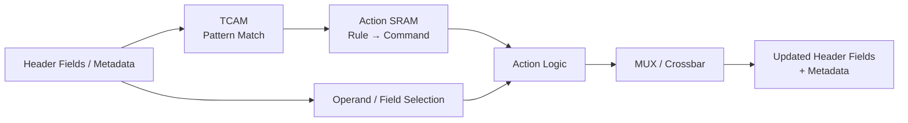

TCAM 找：

```
Which rule matches?
```

Action RAM 决定：

```
What action belongs to this rule?
```

Action Logic 和 MUX 则完成：

```
How should the metadata/header be transformed?
```

Fulcrum 把这一结构称为通用的 **TCAM/RAM/MUX Stage**。

#### TCAM → Action SRAM：早期 Match-Action

假设我们要实现：

```
如果：
    Packet 是 IPv4
    &&
    Route Valid
    &&
    不是 Multicast

那么：
    根据 Route Result 修改 DMAC
```

传统 RTL 可能直接写成：

```
IF IPv4 && RouteValid && !Multicast
    DMAC = NextHopMAC
```

而 FlexPipe 可以把它转成：

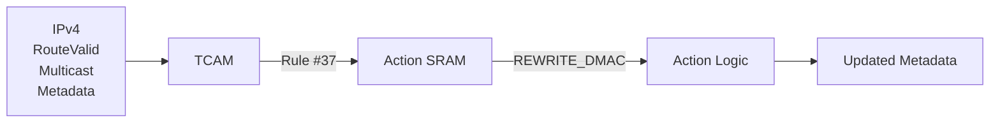

于是硬件不需要知道：

> `Rule #37` 为什么代表 IPv4 routing。

它只需要知道：

```
Key matches entry 37
      ↓
Read Action 37
      ↓
Perform transformation
```

Fulcrum 的 Action RAM 就是将 winning TCAM rule number 映射成一组 transformation controls。

从今天的视角看，这个结构非常熟悉：

```
MATCH
  ↓
ACTION
  ↓
METADATA
```

#### Pipelined Loop Unrolling

如果只有一次：

```
Match → Action
```

其实还不足以完成复杂 Ethernet Forwarding。

一次 Packet Processing 通常存在依赖关系：

```
先解析 EtherType

然后才能知道：
这是 IPv4

然后才能查 Route

Route Lookup 之后：
才能得到 NextHop

NextHop 之后：
才能获得新的 DMAC

之后才能：
执行新的 L2 Lookup

最后才能：
确定 Egress Destination
```

于是 Fulcrum 做了一件非常重要的事情：

**把多个 Match / Lookup / Action Stage 串联起来。**

```mermaid
flowchart LR
    META0["Metadata v0"]

    META0 --> M0["Match"]
    M0 --> A0["Action"]
    A0 --> META1["Metadata v1"]

    META1 --> M1["Match"]
    M1 --> A1["Action"]
    A1 --> META2["Metadata v2"]

    META2 --> M2["Match"]
    M2 --> A2["Action"]
    A2 --> META3["Metadata v3"]

    META3 --> DOT["..."]

    DOT --> OUT["Final Metadata"]
```

关键在于：

> **前一级产生的结果，可以继续成为后一级的输入。**

所以：

```
Stage 0
判断是什么 Packet
      ↓
Stage 1
根据类型做 Classification
      ↓
Stage 2
根据 Classification 做 Route Lookup
      ↓
Stage 3
根据 Route Result 找 NextHop
      ↓
Stage 4
根据 NextHop 决定新的 L2 信息
```

Fulcrum 将这种方式称为：

**Pipelined Loop Unrolling**

并明确指出，每一级的 TCAM Key、TCAM/RAM 容量以及 Action Function 都可以不同。重复这些 Stage 后，就能形成 fully-pipelined iterative header transformations。

#### FlexPipe 不是一排完全相同的 Stage

这一点非常重要。

FlexPipe **不是后来 RMT/PISA 那种高度规则化的 homogeneous Match-Action Pipeline**。

它是一条：

> **Heterogeneous Pipeline**

Fulcrum 根据不同任务，为每一段配置不同类型的资源。

主要可以分成三类。

##### CAM/RAM Programmable Stages


例如：

```
PARSER
FFU
L3AR
L2AR
```


重点资源是：

```
TCAM
  +
Action RAM
```

非常适合：

```
Classification
ACL
Pattern Matching
Metadata Transformation
```

##### Table Lookup Action Stages

例如：

```
NEXTHOP
L2F
MCAST
```

更强调：

```
Large SRAM Table
```

适合：

```
Index
 ↓
Lookup
 ↓
Result Mapping
```

比如：

```
NextHop Index
      ↓
NextHop Table
      ↓
DMAC / VLAN / Tunnel Information
```

##### Fixed-Function Action Stages

例如：

```
ALU
POLICER
COUNTER
HASH
```

这些地方则没有必要为了“可编程”而强行使用 TCAM。

专用硬件实现：

```
Arithmetic
Checksum
Hash
Range Compare
Policing
Statistics
```

面积和效率会更好。

因此 FlexPipe 实际上更接近：

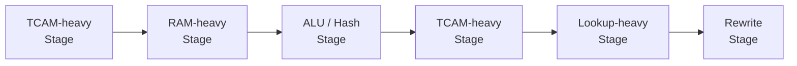

而不是：

```
Generic Stage
Generic Stage
Generic Stage
Generic Stage
```

这也是为什么称它为：

**heterogeneous programmable pipeline**

会比单纯说“programmable switch”更加准确。

#### Parser 本身也是 Pipeline 的一部分

FlexPipe 的灵活性甚至从 Parser 就已经开始了。

Fulcrum 的 Configurable Parser 会逐步读取 Packet Header，并维护：

```
STATE
FLAGS
FIELDS
CHECKSUM
```

例如解析到：

```
EtherType = IPv4
```

它可以生成：

```
FLAGS.IsIPv4 = 1
FIELDS.L2TYPE = 0x0800
STATE.Header = IPv4
```

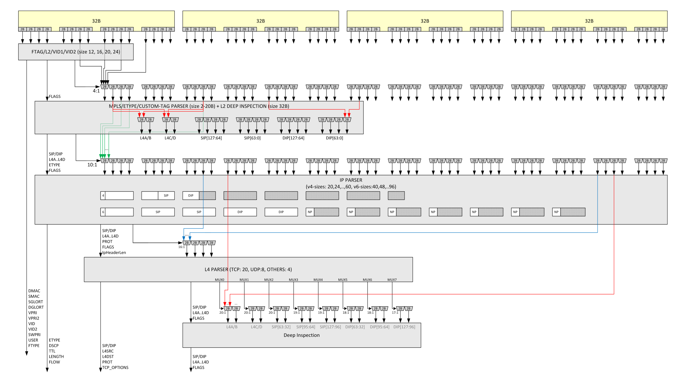

这些 Metadata 随后继续向 FFU、NextHop 等后续 Stage 传播。Alta 的 Parser 被实现成 fully-pipelined、loop-unrolled parsing state machine，Hot Chips 资料给出的固定最大 parsing depth 为 **128 bytes**。

可以简单画成：

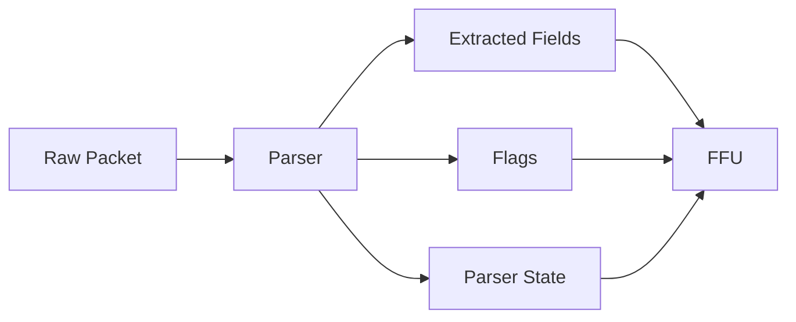

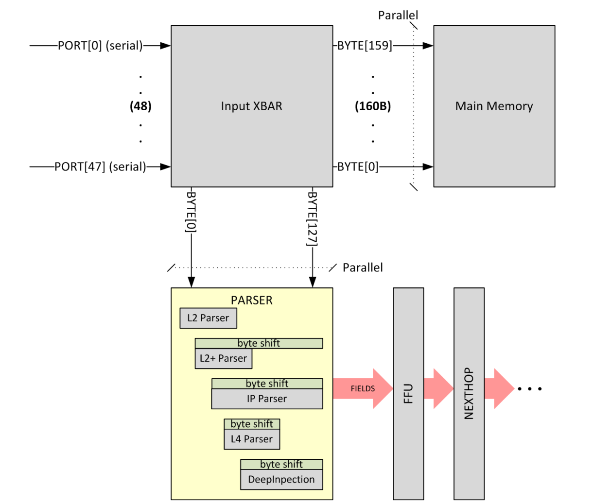

也就是说：

> **FlexPipe 操作的核心并不是整个 Packet Payload，而是一条不断被丰富和修改的 Header + Metadata Bus。**

#### FFU：FlexPipe 的 Match-Action 核心

FlexPipe 中最具代表性的模块之一就是：

**FFU — Filtering and Forwarding Unit**

它并不是简单的一块“大 ACL TCAM”。

FFU 内部包含多组：

```
CAM
 ↓
Action RAM
 ↓
Action Cascade
```

并允许前一组 Slice 的结果成为后续 Slice 的 Key。

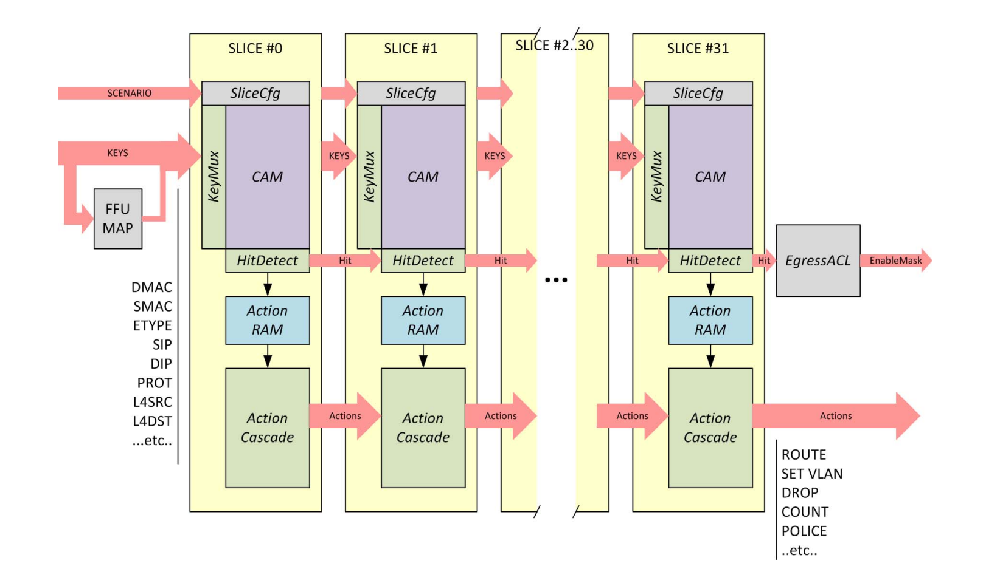

所以它可以形成：


Fulcrum 特别指出，第一组 CAM Slice 的输出可以进入下一组，实现：

**Second-order iterative matching**。

这意味着：

```
Match
 ↓
Derive Information
 ↓
Match Again
 ↓
Derive More Information
```

而不是：

```
ACL Lookup
 ↓
Done
```

#### 为什么这种设计特别有价值？

最能说明问题的是 Alta Tape-out 后发生的事情。

Fulcrum 在设计阶段并没有把所有未来 Feature 都列进规格。

但最终他们发现，由于 Pipeline 本身具有足够的可配置性，Alta 可以支持很多在 specification closure 后才确认的功能，例如：

```
FCoE
Native Fibre Channel
IP-in-IP
IPv4 ↔ IPv6 Translation
GRE
NAT
VEPA / VEPA+
VN-Tag
VPWS / VPLS
LISP
OpenFlow 0.9 / 1.0 / 1.1
```

Fulcrum 在 Hot Chips 中直接把这些称为：

**Bonus Features**

并明确将其归功于 Pipeline Configurability。

这可能就是 FlexPipe 最能体现价值的地方：

```
Traditional ASIC:

New Feature
    ↓
Need New Silicon


FlexPipe:

New Feature
    ↓
Can existing Match / Lookup / Action
resources express it?
    │
    ├── Yes → Microcode / Table Configuration
    │
    └── No  → Need New Silicon
```

FlexPipe 当然不能解决所有问题。

但它显著扩大了：

> **Tape-out 之后还能通过软件重新解释硬件的范围。**

#### Broadcom vs Fulcrum

可以把两种思路概括成：

|              | Broadcom Trident               | Fulcrum FlexPipe                                   |
| ------------ | ------------------------------ | -------------------------------------------------- |
| 设计中心     | 丰富的专用 Forwarding Engines  | 可配置的 Processing Pipeline                       |
| Parser       | Frame Parser                   | Configurable Parser                                |
| VLAN         | Dedicated VLAN Engine          | Match/Lookup/Action 组合                           |
| L2           | Dedicated L2 Forwarding        | L2 Lookup + GloRT + L2F                            |
| L3           | Dedicated L3 Routing           | FFU + NextHop + L3AR                               |
| ACL          | Multistage ContentAware Engine | FFU TCAM/Action RAM                                |
| Tunnel       | Dedicated Tunneling Engine     | Pipeline + NextHop + Modify                        |
| Action Model | Engine-oriented                | Distributed Match/Map/Action                       |
| Pipeline     | Function-oriented              | **Heterogeneous computational stages**             |
| 软件配置     | Configure predefined features  | Configure tables + microcode-like behavior         |
| 灵活性重点   | Feature richness               | **Expressing features through generic primitives** |

两条路线最终都能：

```
Switch
Route
ACL
Tunnel
QoS
```

但是思考问题的方法不同。

Broadcom 更接近：

```
Build powerful forwarding engines
      ↓
Expose them through SDK
```

而 Fulcrum 更接近：

```
Build reusable computational primitives
      ↓
Compose forwarding behavior from them
```

这正是 FlexPipe 最独特的地方。

#### FlexPipe 与 RapidArray

现在就可以把前两节真正连接起来。

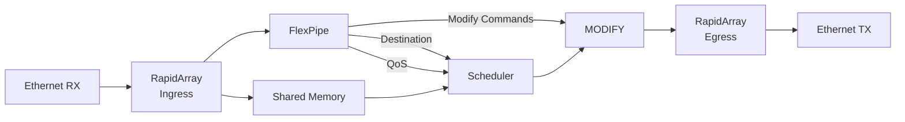

两套架构各自负责：

```
RapidArray
    ↓
Where is the packet stored?
When can the packet move?


FlexPipe
    ↓
What is the packet?
Where should it go?
What should be done to it?
```

可以进一步浓缩成：

```
RapidArray = Movement

FlexPipe   = Intelligence
```

而它们共同构成了 Fulcrum Switch Architecture 最核心的两部分。

### GloRT：逻辑目的地与交换 Fabric 寻址

在传统 Ethernet Switch 中，我们习惯把转发理解成：

```
DMAC + VLAN
      ↓
MAC Table
      ↓
Physical Port
```

例如：

```
00:11:22:33:44:55
        ↓
MAC Table Lookup
        ↓
Port 17
```

这套模型对于一颗独立交换芯片来说非常自然。

但 Fulcrum 从 FM5000/FM6000 开始面对的已经不只是：

> 一个 Packet 应该从哪个物理 Port 发出去？

而是更加复杂的问题：

> 如果一个逻辑交换机由多颗 ASIC 组成怎么办？

> 如果 Destination 是一个 LAG，而不是一个 Port 呢？

> 如果 Destination 是 Multicast Group、CPU、Mirror Destination 呢？

> 到了 FM10000，如果 Destination 甚至不是 Ethernet Port，而是一个 PCIe Host、VF 或 Tunnel Engine 呢？

Fulcrum 为此引入了一个非常重要的抽象：

**GloRT — Global Resource Tag**

到了 FM10000，Intel 又在它外面发展出了：

**FTAG — Fabric Tag**

这两个机制共同构成了 FM6000 → FM10000 架构中一个非常独特的 **Logical Fabric Addressing System**。

#### GloRT：不要把 Destination 直接写成 Physical Port

FM5000/FM6000 Datasheet 对 GloRT 的定义非常明确：

> GloRT 是一个 **16-bit number**，可以表示特定 Port、Link Aggregation Group、Multicast Group、Management Frame，或者 Single/Multi-stage Fabric 中的其他 Packet Destination。

所以传统思路：

```
Destination = Port 17
```

在 Fulcrum 中可以变成：

```
Destination = GloRT 0x4200
```

至于：

```
0x4200
```

最后到底代表：

```
Port 17
```

还是：

```
LAG 5
```

甚至：

```
另一颗 FM6000 上的一组 Port
```

由后面的 **GloRT Resolution** 决定。

#### GloRT 本质上是一个 Logical Port

FM6000 Datasheet 对这个思想有一句非常关键的描述：

> FM5000/FM6000 在概念上是一颗运行在 **virtualized physical layer** 上的 switch-router。

在这层抽象中，一个“Port”可以表示：

- Physical Ethernet Port
- LAG
- Remote CPU
- Attached CPU
- Internal Loopback Entity
- Multicast Group
- Load-Balancing Group
- 甚至分布在多颗 FM6000 ASIC 上的资源。

因此可以把它理解成：

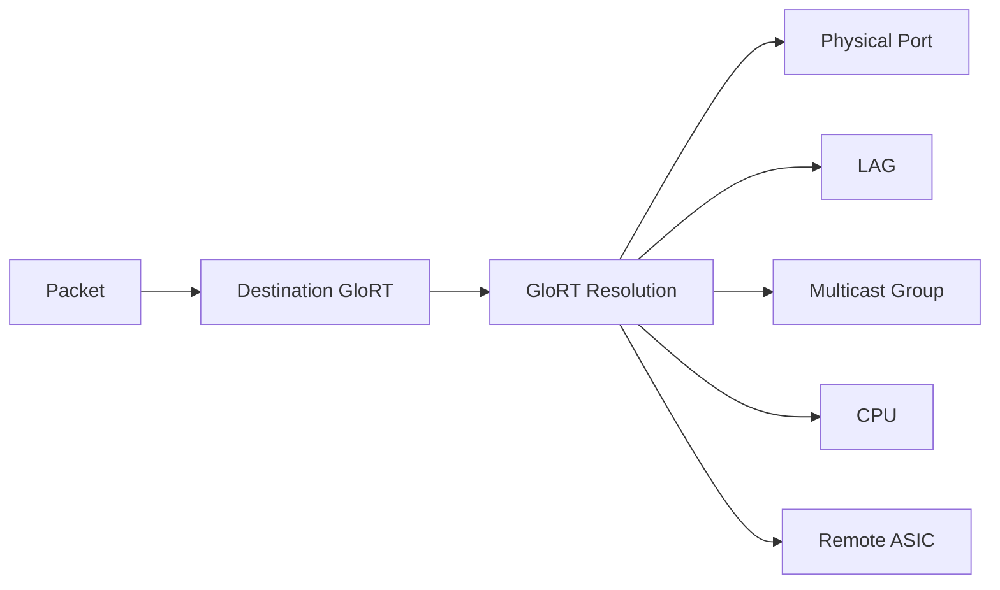

这其实是一个非常漂亮的抽象：

```
Logical Destination
        ↓
Physical Realization
```

被彻底分离了。

#### SGLORT 与 DGLORT

一个 Packet 在 Fulcrum Fabric 中通常会存在两个非常重要的身份：

```
SGLORT
Source Global Resource Tag

DGLORT
Destination Global Resource Tag
```

它们的意义可以简单理解为：

```
SGLORT = Where did this frame come from?

DGLORT = Where should this frame go?
```

例如：

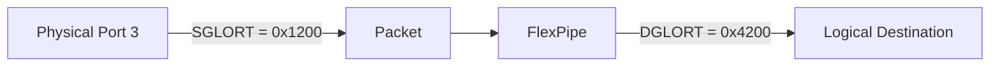

在 FM5000/FM6000 中，一个没有携带 Inter-Switch Fabric Tag 的 Frame 从物理端口进入时，会被赋予该 Port 对应的 **Per-Port Source GloRT**。如果随后发生 Source MAC Learning，这个 Source GloRT 甚至会和 Source MAC 一起写入 MAC Table。

所以 MAC Table 中的 forwarding result 并不一定是：

```
MAC
 ↓
Port Number
```

而可以更准确地理解成：

```
MAC
 ↓
GloRT
 ↓
Physical Destination Resolution
```

#### 为什么不能直接在 MAC Table 里保存 Port？

因为如果保存：

```
MAC → Port 17
```

这个 entry 天生就是：

> **Local ASIC Specific**

换一颗 ASIC：

```
Port 17
```

可能完全代表另外一个物理接口。

但如果保存：

```
MAC → GloRT 0x4200
```

那么：

```
0x4200
```

可以在整个 Multi-chip Fabric 中保持同一个**逻辑含义**。

不同芯片只需要知道：

> 我应该如何把 `0x4200` 映射到我自己的本地出口？

于是就可以形成：

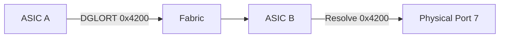

对于 ASIC A：

```
0x4200
    ↓
Send toward ASIC B
```

对于 ASIC B：

```
0x4200
    ↓
Physical Port 7
```

**同一个 Logical Destination，不同 ASIC 做不同的 local resolution。**

这正是 GloRT 真正有价值的地方。

#### 从 GloRT 到 Physical Port：不是一次简单查表

GloRT 也不是：

```
GloRT → Port
```

这么简单。

FM6000 的 GloRT Lookup 本身就是 FlexPipe 中一个相当完整的 Stage。

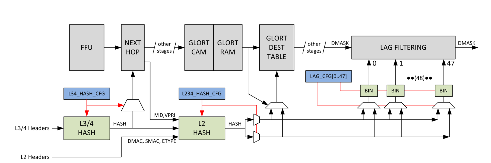

处理过程大约为：

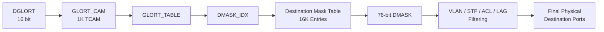

FM6000 的 GloRT Stage 首先使用一个 **1K-entry TCAM/RAM** 匹配 DGLORT，然后产生 Destination Mask Table 的索引；随后一个 **16K-entry Destination Mask Table** 将这个索引转换为 Physical Destination Mask。

所以：

```
DGLORT
   ↓
Logical Destination Resolution
   ↓
DMASK_IDX
   ↓
Physical Destination Bitmap
```

#### DMASK：GloRT 最终变成真正的物理出口

FM6000 的 Physical Forwarding 最终使用一个：

**76-bit Destination Mask — DMASK**

其中：

```
DMASK[n] = 1
```

表示：

```
Forward one copy to physical destination n
```

例如：

```
DMASK

00000000 00000000 00000000 00100100
                           ↑     ↑

                        Port 5  Port 2
```

表示 Packet 需要复制到两个 Destination。

但 GloRT Lookup 只是产生最初的 forwarding distribution。

之后 DMASK 还要经历：

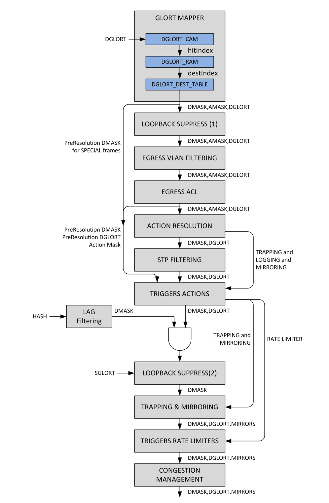

FM6000 Datasheet 明确列出了这一过程：Initial GloRT mapping 之后，还会依次受到 VLAN Membership、STP、LAG、Security Policy、CPU Trap、Mirroring 以及 Congestion Management 等条件影响。

这说明一个很重要的问题：

> **GloRT 表示的是逻辑上的“我要去哪里”，DMASK 才是当前 ASIC 最终实际使用的 Physical Egress Set。**

因此可以写成：

```
GloRT
    =
Logical Destination

DMASK
    =
Physical Realization
```

#### GloRT 甚至可以直接表示 LAG

这就是这套架构开始体现威力的地方。

假设：

```
GloRT 0x4200 = LAG A
```

而 LAG A 包含：

```
Port 1
Port 3
Port 7
Port 11
```

逻辑上 FlexPipe 只需要说：

```
DGLORT = 0x4200
```

不需要关心最终到底走：

```
Port 1
```

还是：

```
Port 7
```

随后 GloRT Stage 可以结合：

```
L2_HASH
```

执行：

```
LAG Pruning
        +
LAG Filtering
```

最终从这个逻辑 Group 中选择一个 Physical Member。FM6000 的 GloRT Lookup 甚至允许不同 GloRT Entry 选择不同 Hash Rotation 来完成这一过程。

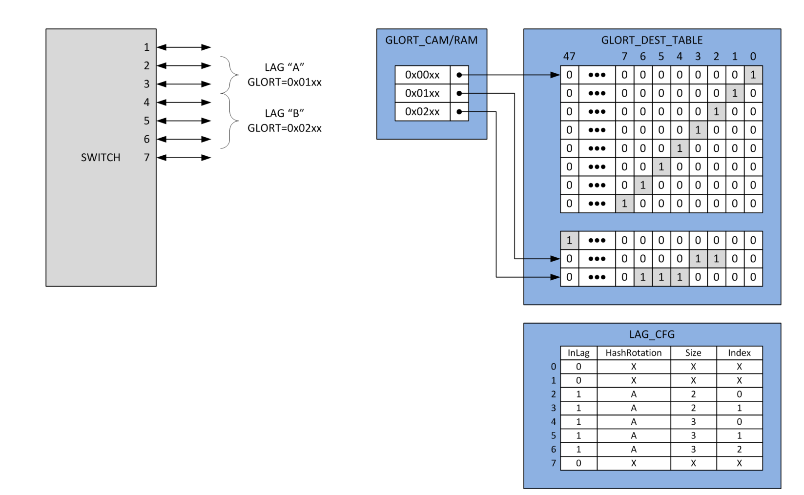

因此：

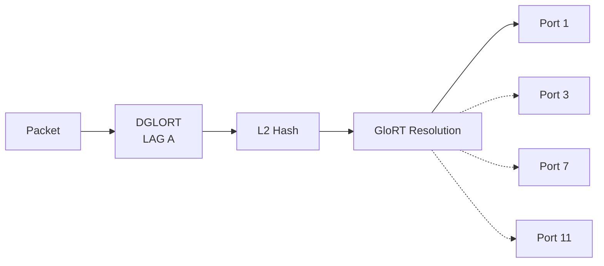

这就把：

```
Forwarding Decision
```

与：

```
Load-Balancing Decision
```

分离了。

FlexPipe 决定：

> **去 LAG A。**

GloRT/LAG Logic 决定：

> **这一个 Flow 实际走 LAG A 的哪条 Link。**

#### Multi-Chip Fabric：GloRT 真正的目标

到这里，就可以理解为什么 Fulcrum 不满足于传统：

```
MAC → Physical Port
```

了。

假设我们有四颗 FM6000：

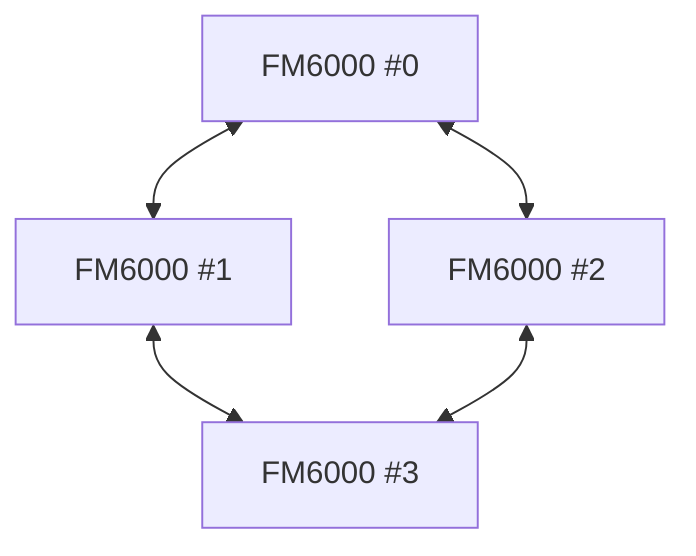

站在软件层面，可以希望它们不是：

```
Four separate switches
```

而是：

```
One Logical Switch
```

于是：

```
Port
LAG
Multicast Group
CPU
```

都不应该被限制在某一颗 ASIC 的 local numbering space。

Fulcrum 因此构造出：

```
            Global Logical Address Space
                       │
                     GloRT
                       │
       ┌───────────────┼───────────────┐
       ▼               ▼               ▼
   FM6000 #0        FM6000 #1       FM6000 #2
       │               │               │
    Local Port       Local Port      Local Port
```

FM6000 Datasheet甚至明确把多个 FM5000/FM6000 组成的系统称作一个：

**multi-chip domain**

而这些 ASIC 通过 Fabric Tag 携带逻辑 Port 信息，从而构成统一的虚拟 Physical Layer。

#### 问题来了：GloRT 怎样跨 ASIC？

GloRT 是 ASIC 内部的 Metadata。

但 Ethernet Link 本身只传：

```
DMAC
SMAC
EtherType
Payload
...
```

如果 Packet 从：

```
ASIC A
```

进入：

```
ASIC B
```

ASIC B 怎么知道：

```
Original SGLORT
Destination DGLORT
Internal Priority
Fabric State
```

这些信息？

这就是：

**Fabric Tag**

存在的意义。

#### FM6000 时代：F56 / F64 / F96

事实上，FTAG 的思想并不是 FM10000 才突然出现。

FM5000/FM6000 已经支持多种 Intel/Fulcrum 私有的 Inter-Switch Tag：

```
F56
F64
F96
```

用于 Multi-chip Switching。Intel 官方 Datasheet 明确说明，多颗 Switch 可以通过普通 Ethernet Port 互联，并扩展 Ethernet Frame Format 来携带额外 Fabric Information。

因此逻辑上已经是：

```
Ethernet Frame
      +
Fabric Metadata
      ↓
Inter-Switch Link
```

GloRT 负责：

```
Logical Identity
```

Fabric Tag 负责：

```
Transport Logical Identity
```

#### FM10000：FTAG 成为体系核心

到了 FM10000，这套概念被进一步扩展成非常明确的：

**Fabric Tag — FTAG**

Intel FM10000 Datasheet 对它的定义非常值得注意：

FTAG 可以在：

```
Switch ↔ Switch

Switch ↔ PCIe Host Interface

Switch ↔ Tunneling Engine
```

之间携带内部信息。

Intel甚至明确表示，它对于多个 Switch 表现成：

> **one switch**

是必要的。

这也是 FM10000 与普通 NIC 开始出现本质区别的地方。

#### FTAG 里装了什么？

FM10000 的 FTAG 包括：

```
USER      8 bit   *
FTYPE     2 bit
SWPRI     4 bit
DGLORT   16 bit
SGLORT   16 bit
VPRI      4 bit
VID      12 bit
```

其中 `USER` 字段用于 PCIe / Tunnel Engine 形式的 FTAG，在 Ethernet Switch-to-Switch FTAG 中不可用。

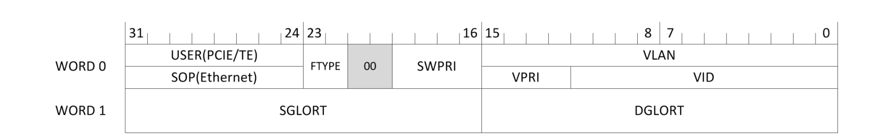

从功能上看可以整理成：

| Field      | 作用                            |
| ---------- | ------------------------------- |
| **SGLORT** | Packet 的逻辑 Source            |
| **DGLORT** | Packet 的逻辑 Destination       |
| **SWPRI**  | Fabric 内部 Switching Priority  |
| **VID**    | Fabric 中关联的 VLAN ID         |
| **VPRI**   | VLAN Priority                   |
| **FTYPE**  | Normal / Special Frame          |
| **USER**   | PCIe/Tunnel 使用的额外 Metadata |

Intel FM10000 Datasheet明确规定了这些字段，而 DPDK 也把 FTAG 描述为携带 Packet 来源、目的地以及 VLAN 等 Fabric Information 的特殊 Tag。

所以 FTAG 很像：

```
┌──────────────────────────────────────────┐
│              Fabric Metadata             │
├───────────┬───────────┬──────────────────┤
│  SGLORT   │  DGLORT   │ Priority / VLAN  │
├───────────┴───────────┴──────────────────┤
│              Ethernet Frame              │
└──────────────────────────────────────────┘
```

#### 一个特别漂亮的设计：Ethernet FTAG 可以复用 Preamble

普通 Ethernet Frame 开始时：

```
Preamble
   ↓
SFD
   ↓
DMAC
SMAC
...
```

而 FM10000 在 Switch-to-Switch Ethernet Link 上，可以**复用 Ethernet Preamble 的空间来携带 FTAG**。

Intel 给出的设计目的是：

> 避免因为加入 Fabric Metadata 而额外消耗 Link Bandwidth。

而在：

```
PCIe Host Interface
```

或：

```
Tunnel Engine
```

方向，FTAG 则直接加在 Frame 前面。

所以：

```mermaid
flowchart TB
    subgraph ETH["Switch ↔ Switch"]
        E1["Ethernet Frame"]
        E2["Preamble Space<br/>carries FTAG"]
        E2 --> E1
    end

    subgraph PCIE["PCIe / Tunnel"]
        P1["FTAG"]
        P2["Ethernet Frame"]
        P1 --> P2
    end
```

这是 FM10000 Datasheet 对 Frame Tagging 的直接描述。

而且 Ethernet Port 上的 FTAG 是：

> **per-port enabled**

并且 Intel 要求这种模式用于受信任的 Switch-to-Switch 链路，而不是普通外部 Ethernet Endpoint。

#### FTAG 和 VLAN Tag 不是一回事

看到：

```
VID
VPRI
```

很容易误以为 FTAG 是另外一种 VLAN Tag。

不是。

VLAN Tag 描述：

```
Tenant / Broadcast Domain / Priority
```

而 FTAG 描述的是：

```
Fabric Forwarding Context
```

它实际上把：

```
Original Logical Source
Logical Destination
Switch Priority
VLAN Context
Frame Type
```

一起带过去。

因此更接近：

```
Internal Fabric Header
```

而不是：

```
802.1Q VLAN Header
```

#### FTAG 最重要的是保留 DGLORT

假设 Switch A 已经做完：

```
DMAC Lookup
    ↓
DGLORT = 0x4200
```

如果 Packet 去到下一颗 Switch 后重新执行：

```
DMAC + VLAN Lookup
```

不仅重复工作，而且可能因为两颗芯片的 Local State 不同而得到不同结果。

有 FTAG 后：

```mermaid
flowchart LR
    A["Switch A"]

    A --> LOOKUP["L2 / L3 Lookup"]

    LOOKUP --> G["DGLORT = 0x4200"]

    G --> FT["FTAG"]

    FT --> LINK["Fabric Link"]

    LINK --> B["Switch B"]

    B --> RESOLVE["Resolve DGLORT"]

    RESOLVE --> PORT["Local Physical Port"]
```

Switch B 不需要重新回答：

> **这个 Packet 的最终逻辑目的地是谁？**

因为 Switch A 已经告诉它了：

```
DGLORT = 0x4200
```

Switch B 更关心：

> **0x4200 在我这一颗 ASIC 上应该如何实现？**

这就是一种非常典型的：

```
Global Forwarding Decision
        ↓
Local Physical Resolution
```

#### FM10000 甚至可以完全根据 FTAG/GloRT 转发

这点非常有意思。

DPDK 对 FM10K 的说明明确写道：

> 在 FTAG Based Forwarding Mode 中，Switch Logic 根据 **GloRT information** 转发 Packet，而不是根据 MAC/VLAN Table。

也就是说：

##### 普通 Ethernet forwarding

```mermaid
flowchart LR
    P["Packet"]

    P --> MAC["DMAC + VLAN"]

    MAC --> TABLE["MAC Table"]

    TABLE --> G["DGLORT"]

    G --> PORT["Destination"]
```

##### FTAG forwarding

```mermaid
flowchart LR
    P["Packet + FTAG"]

    P --> G["DGLORT"]

    G --> PORT["Destination"]
```

中间：

```
MAC Lookup
```

可以被绕开。

这也是为什么 DPDK 把：

**FTAG Based Forwarding**

直接称为 FM10K 的一个 **unique feature**。

#### 一个实际的 DPDK 例子

DPDK 官方 FTAG Test Plan 甚至保留了一组非常有价值的实际数据。

例如一个 FM10K 测试环境中：

```
Logical Port 4122
    ↓
GloRT 0x4000

Logical Port 4123
    ↓
GloRT 0x4200
```

然后 DPDK 将这些值导出：

```
export PORT0_GLORT=0x4000
export PORT1_GLORT=0x4200
```

再构造带有相应 FTAG 的 Packet，让硬件直接按照 GloRT 将 Packet 送往目标 Port。

这个例子非常能说明：

```
Logical Port ID
       ≠
GloRT
       ≠
Physical Port Number
```

它们是三个不同层次的概念。

#### FM10000 中 DGLORT 是怎样产生的？

FM10000 的 DGLORT 不只是 L2 Lookup 产生。

Intel Datasheet 描述了完整的处理顺序：

```mermaid
flowchart LR
    P["Parser"]

    P --> FFU["FFU"]

    FFU --> NH["NextHop"]

    NH --> L2["L2 Lookup"]

    L2 --> DM["DMASK Generation"]

    DM --> TR["Triggers"]

    TR --> SCH["Scheduler"]

    SCH --> MOD["Modify / FTAG"]
```

其中 DGLORT 可以在多个 Stage 中产生或改变。

##### Step 1 — Parser

如果收到 FTAG：

```
DGLORT ← incoming FTAG
```

否则：

```
DGLORT = 0
```

##### Step 2 — FFU

FFU 可以执行：

```
SET_GLORT
```

或者：

```
SET_ROUTE
```

##### Step 3 — NextHop

Route/NextHop Lookup 可以得到新的：

```
DGLORT
```

##### Step 4 — L2 Lookup

执行：

```
DMAC + EVID
```

lookup。

Hit：

```
MAC Entry → DGLORT
```

Miss：

```
DGLORT = Flood GloRT
```

##### Step 5 — DMASK Generation

将：

```
DGLORT
```

转换成：

```
Physical Destination Mask
```

##### Step 6 — Scheduler / MODIFY

最终如果 Packet 还要进入：

```
another FM10K
PCIe Host
Tunnel Engine
```

MODIFY 可以把相应：

```
SGLORT
DGLORT
```

重新放进 FTAG。

这套 DGLORT processing sequence 来自 Intel FM10000 Datasheet 的 Frame Processing architecture。

因此可以非常漂亮地概括成：

```
Parse
  ↓
Classify
  ↓
Route
  ↓
Bridge
  ↓
Resolve Logical Destination
  ↓
Resolve Physical Destination
  ↓
Schedule
  ↓
Carry Logical Destination Forward
```

#### `firstGlort` 为什么会出现在 FM10K 软件里？

理解这些之后，再看到 FM10K SDK / Switch Software 中类似：

```
firstGlort
```

这样的字段，就不会显得奇怪了。

GloRT 本身是一个：

```
16-bit Logical Fabric Namespace
```

而不是简单的：

```
Physical Port Number
```

因此软件往往需要为：

```
Physical Ports
PCIe PEPs
LAGs
Multicast Groups
Other Logical Endpoints
```

分配不同 GloRT 范围。

所以像：

```
firstGlort = ...
```

这种字段，更适合理解成：

> **某组 Fabric Resource 所使用的 GloRT Namespace / Range 的起始值。**

而不是：

> “第 5040 个物理端口”。

具体数值如何编码仍然取决于平台和 SDK 的 GloRT allocation policy，不能只根据一个 `firstGlort` 数值反推出 Physical Port。

#### 最终可以把 FM10840 想象成这样

```mermaid
flowchart TB
    RX["Packet"]

    RX --> PARSER["Parser<br/>SGLORT / Incoming DGLORT"]

    PARSER --> FLEX["FlexPipe"]

    FLEX --> FFU["FFU"]
    FFU --> NH["NextHop"]
    NH --> L2["L2 Lookup"]

    L2 --> DG["DGLORT"]

    DG --> RESOLVE["GloRT Resolution"]

    RESOLVE --> DMASK["Physical DMASK"]

    DMASK --> SCH["Scheduler"]

    SCH --> DEST{"Destination Type"}

    DEST --> ETH["Ethernet"]
    DEST --> PCI["PCIe Host"]
    DEST --> TUN["Tunnel Engine"]
    DEST --> FAB["Another Switch"]

    PCI --> FT["FTAG"]
    TUN --> FT
    FAB --> FT
```

这样一来，前面几章也就真正串在了一起：

```
QDI
 ↓
How the circuits run

RapidArray
 ↓
How packets move

FlexPipe
 ↓
How packets are understood

GloRT
 ↓
How destinations are represented

FTAG
 ↓
How forwarding context moves across the fabric
```

#### 为什么 GloRT + FTAG 值得单独写？

因为它们揭示了 FM10K 最重要的设计特征之一：

> **Port 不再只是芯片边缘的一根 Ethernet SerDes。**

在 FM10000 的世界里：

```
Physical Ethernet Port
PCIe Host Interface
Tunnel Engine
Remote ASIC Resource
LAG
Multicast Group
```

都可以被抽象为某种：

**Logical Fabric Resource**

然后由：

```
GloRT
```

标识，再通过：

```
FTAG
```

把这种身份随着 Packet 在 Fabric 中传播。

所以如果必须用一句话总结：

> **GloRT decouples forwarding decisions from physical ports, while FTAG carries that logical forwarding context across FM10K fabric boundaries.**

中文则可以概括成：

> **GloRT 将“转发到哪里”从物理端口编号中抽象出来，而 FTAG 则负责让这种逻辑转发上下文跨越交换芯片、PCIe Host 和 Tunnel Engine 继续存在。**

也正是从这里开始，FM10840 已经很难再被简单称作“一颗 100G 网卡芯片”。

它更像是一颗：

**拥有 PCIe Endpoint 的分布式 Ethernet Switch Fabric。**

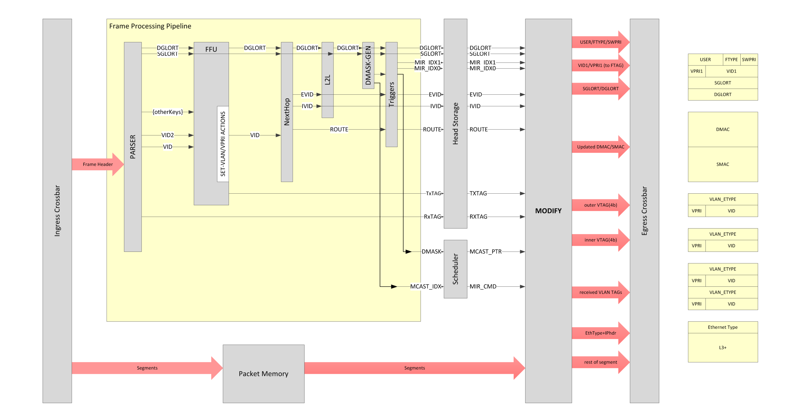