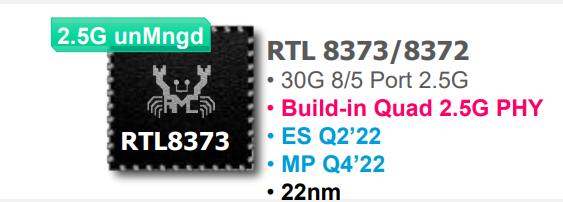
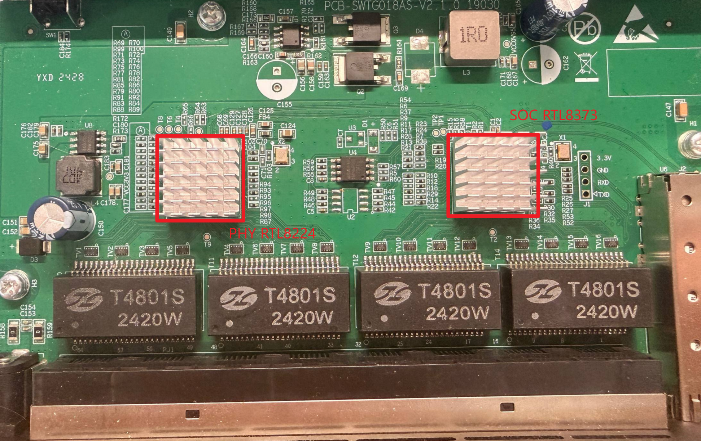
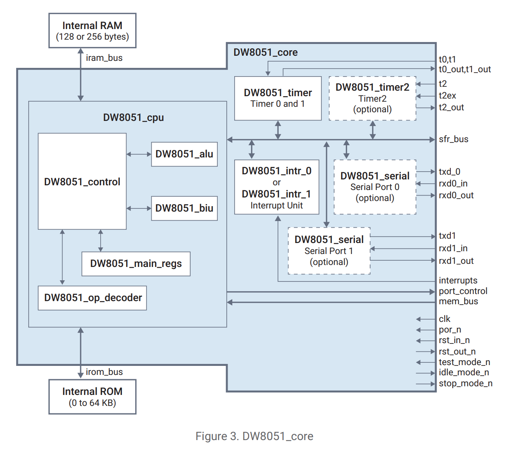
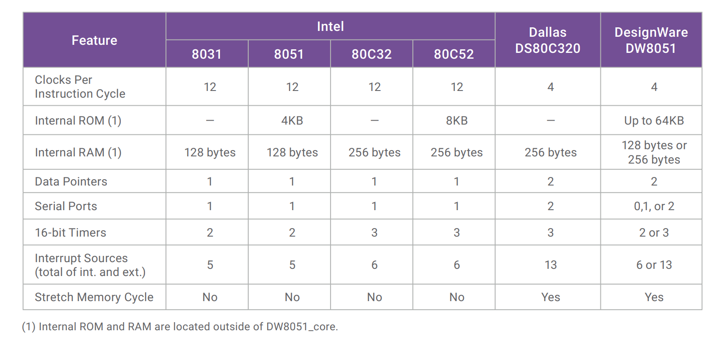
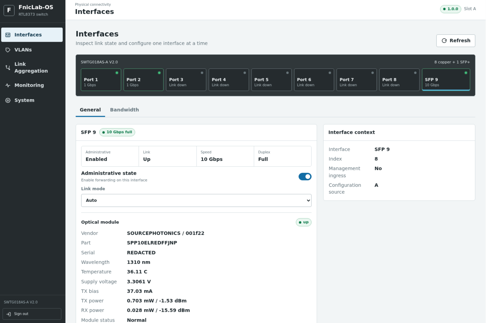

# 来给你的rtl837X写一套自己的操作系统吧

> 这篇文章属于想到什么写什么，因为我系统已经写好了。但是写文章的时候我又在重构它。所以有很多当时遇到的东西就写进去了



刚开始引出这个想法是因为之前的文章，我的稀客交换机 *兮克 SKS3200-8E1X* 在升级后暴毙了。在查阅了大量的参考文献后，首先找到了这个项目

[SWTG118AS](https://github.com/up-n-atom/SWTG118AS)，我一看哇，有这么好的项目你怎么不早点告诉我！在翻阅这个项目时我也看到了 [Horaco 2.5GbE Managed Switch ](https://forums.servethehome.com/index.php?threads/horaco-2-5gbe-managed-switch-8-x-2-5gbe-1-10gb-sfp.41571/)。

从他们的探索可以得知固件是有校验的，看起来修改什么的也是很麻烦。在寻找之中我就发现了引出自研交换机操作系统的 [RTLPlayground](https://github.com/logicog/RTLPlayground)

## 探索RtlPlayground

这个项目真的是令我眼前一亮，基本上可以从boot到交换芯片初始化再到最后的配vlan端口聚合。可谓是想要的功能都在里面了。

- A modern web-interface with mouse-over to display further information
- A serial console interface to configure all features
- IGMP to configure Multicast streaming
- Port configuration showing detailed informtion about own and Link-partner advertised Speed settins and configuration of these settings on the local side
- Per-port configuration of frame sizes (MTUs) for Jumbo-Frame support or limiting MTUs for particular devices
- EEE (Energy Efficient Ethernet) can be configured per-port. Detailed information is provided for support offered by the link partner and the EEE status of a port.
- VLAN configuration
- SFP information is displayed on the inserted modules, the current sensor values such as temperatures, RX and TX power are displayed in the CLI and as mouse-over on the web
- Mirror configuration
- Link Aggregation Groups can be set up
- Detailed information on port packet statistics
- Configuration saved to flash via the web-interface
- Firmware updates via the web
- Installation as a firmware upgrade from the original web-interface

但是这个项目的缺点就是uip，这个项目由于只允许单个连接导致操作会有明显的卡顿。所以就引出了我自己去写一个交换系统的计划。

## 初步准备

在分析玩这整套固件后，我们来分析下手里的这块板子吧



SWTG018AS-V2。左侧芯片是RTL8224 PHY芯片，右侧则是本项目的主角RTL8373。由于芯片的限制，1-4口是通过phy连接到RTL8373,4-8口以及单独的SFP+则是直接连到SOC。

> RTL8373/RTL8372 
>
> • Integrated 8051 microprocessor  大概率是DW8051 
>
> • Supports SPI Flash/ EEPROM Interface 
>
> • Embedded 4-port 10M/100M/1000M/2.5GBase-T PHY 
>
> • Support two set SERDES interface  
>
> SERDES 0 supports UXGMII to connect one 4-port 2.5GBASE-T PHY 
>
> SERDS 1 supports USXGMII/10G-R/2500X/1000BASE-X/HSGMII/SGMII to connect PHY transceiver, Fiber OE module or external CPU

差不多以下的结构，会更清晰一点。

```
RTL8373
 ├─ internal PHY ×4
 │   └─ 4 × 2.5GbE
 │
 ├─ UXGMII
 │   └─ RTL8224
 │       └─ 4 × 2.5GbE
 │
 └─ SerDes
     └─ 10G SFP+
```

研究完板子的规划我们就要着重的研究下这个处理器了。从之前的前人的探索了解到螃蟹是用的DW8051。（讨厌8051，在处理bank的时候差点给我测到昏古七）

## 测量SOC 






好了，我们已经有了DW8051的datasheet,现在我们可以开始研究这颗RTL8373是否有魔改了DW8051。

> 再通过对CPU进行测量以后，我们得到了一个结论 RTL8373是一个增强型 DW8051-class 4-clock MCS-51 CPU，带 8052-style Timer2、Dual DPTR、扩展中断/串口/Watchdog 外设、64-byte direct-mapped instruction fetch cache，以及 Realtek 自己的 PSBANK program-memory banking 层。

CPU的模型

```
RTL8373 MCU
│
├── MCS-51 / DW8051-class
│
├── ~4-clock basic execution cycle
│
├── 256 B IRAM
│
├── Dual DPTR
│   ├── DPTR0
│   ├── DPTR1
│   ├── selector = DPS.0
│   ├── no automatic toggle observed
│   └── INC DPS = software toggle
│
├── Timer0
│   └── CKCON.3 /12 ↔ /4
│
├── Timer2
│   └── CKCON.5 /12 ↔ /4
│
├── second serial controller
│   └── SCON1
│
├── extended IRQ
│   ├── EIE
│   └── EIP
│
├── XDATA/MOVX
│   ├── ~8 clocks base
│   └── programmable stretch
│
├── CODE fetch cache
│   ├── 16 B line
│   ├── 4 sets
│   ├── 1 way
│   └── 64 B direct mapped
│
└── PSBANK
    └── banked CODE mapping
```

哈哈哈哈哈哈，有了这个结论我就可以对我之前的项目进行优化了！

## 系统设计

这个系统的设计之初我就对bootloader有一种执念，参考了juniper A/B分区，启动失败自动回滚。以至于有了一下的设计架构。

    1. Stage0 不做网络和完整交换芯片初始化。
    2. 可启动 banked 应用不能拥有自己的 reset vector 或 HOME。
    3. 升级只能修改 inactive slot。
    4. payload、Header、valid tag、bootctl 按掉电安全顺序提交。
    5. flash erase/program 只在固定 HOME service 中执行。
    6. CRC32 用于完整性和掉电检测。
    7. Stage0 不在线升级；普通升级不得修改 Stage0 或 boarddata。

Flash Layout 

```
Physical SPI NOR - 2 MiB
0x000000
┌─────────────────────────────────────┐
│ Stage0 / BootRescue                 │
│ 0x000000 - 0x03FFFF                 │
│ size = 256 KiB                      │
├─────────────────────────────────────┤ 0x040000
│ Normal OS Slot A                    │
│ 0x040000 - 0x0FFFFF                 │
│ reserved size = 768 KiB             │
├─────────────────────────────────────┤ 0x100000
│ Normal OS Slot B                    │
│ 0x100000 - 0x1BFFFF                 │
│ reserved size = 768 KiB             │
├─────────────────────────────────────┤ 0x1C0000
│ Reserved                │
│                                     │
├─────────────────────────────────────┤ 0x1E0000
│ CBNF #1 / Control/Boot              |
├─────────────────────────────────────┤ 0x1E4000
│ CBNF #2 / Control/Boot backup       |
├─────────────────────────────────────┤ 0x1E8000
│ DBNF #1 / Board data                │
├─────────────────────────────────────┤ 0x1EC000
│ DBNF #2 / Board data backup         │
├─────────────────────────────────────┤
│ remaining area = FF                 │
└─────────────────────────────────────┘0x1FFFFF
```

系统启动链

```text
            Stage0 Boot Supervisor
                     │
        ┌────────────┼────────────┐
        │            │            │
      Slot A       Slot B       Rescue
        │            │            │
        └────────────┼────────────┘
                     ▼
                Normal OS
                     │
            Switch Control Plane
```

## 刚上来就踩的坑——0x4000

刚开始交给GPT来编译Stage0的固件时，Uart死活是没有输出的。

后来查看RTL8373 的原始 Firmware Image 开头发现：

```
00 40 02 00 4C ...
^^^^^
Header
      ^^^^^^^^^

      8051 CODE
```

其中前两个字节：

```
00 40
```

并不属于 8051 程序代码，而是 RTL8373 Firmware Image 的一个 **2-byte Bank0 Size 字段**。

按照 RTL837x 的镜像布局，这两个字节表示：

```
0x4000 = 16384 Bytes = 16 KiB
```

也就是固定的 **Bank0 / Common Code 区域大小**。

RTL8373 内部的 8051 使用 64 KiB CODE address space，但其程序空间并不是简单连续映射到 SPI Flash，而是划分为：

```
8051 Logical CODE Space

0x0000
┌──────────────────────────────┐
│                              │
│ Bank0 / Common Code          │
│                              │
│ 0x4000 Bytes = 16 KiB        │
│                              │
├──────────────────────────────┤ 0x4000
│                              │
│ PSBANK Window                │
│                              │
│ 0xC000 Bytes = 48 KiB        │
│                              │
│                              │
└──────────────────────────────┘
0xFFFF
```

因此一个完整的逻辑 CODE Window 正好是：

```
0x4000 + 0xC000
= 0x10000
= 64 KiB
```

其中：

- `0x0000–0x3FFF` 为固定的 Common/Bank0 区域；
- `0x4000–0xFFFF` 为受 `PSBANK` 控制的 48 KiB Banked Code Window。

固件文件最前面的 `00 40`，就是用于描述这个 **0x4000 大小的固定 Bank0/Common 区**。

## 给你的CRC加加速——Dual-DPTR

在确认cpu就是DW8051之后，我针对dw8051的特性展开了优化。第一刀就是Dual-DPTP

CRC 计算本身主要是连续读取一段数据并进行异或、移位等运算。对 8051 来说，真正拖慢速度的往往不是 CRC 运算，而是**频繁切换数据地址和 CRC 查表地址**。

普通单 DPTR 只有一个 16 位数据指针：

```
读取数据 → 修改 DPTR 指向 CRC 表
        → 查表
        → 再重新装载 DPTR 指向数据
        → 读取下一个字节
```

因此每处理一个字节，都可能需要多次执行：

```
MOV DPTR,#xxxx
```

或保存/恢复 `DPH:DPL`，产生大量额外指令。

Dual-DPTR 优化后：

- `DPTR0` 始终指向待校验数据。
- `DPTR1` 用于 CRC 查表。
- 用一条很短的 `INC DPS` 在二者之间切换。
- CRC 状态一直保存在 CPU 寄存器中。
- 整个缓冲区在一个汇编循环里完成，不再每字节调用 C 函数。

```
DPTR0 ──读取数据──┐
                  │ INC DPS
                  ▼
DPTR1 ──CRC 查表──┐
                  │ INC DPS
                  ▼
DPTR0 ──读取下一字节
```

它并不是并行计算两个 CRC，也没有提高 CPU 时钟，而是大量减少了：

- 每字节函数调用和返回
- 参数写入 XDATA
- 16 位地址反复保存和加载
- 源指针与查表指针之间的来回重建
- 编译器生成的通用操作

| 指标     | C baseline  | Dual-DPTR   |
| -------- | ----------- | ----------- |
| 中位时间 | 17.281 s    | 7.838 s     |
| 吞吐率   | 44.21 KiB/s | 97.47 KiB/s |
| 抖动     | 0.015%      | 0.078%      |

## 半成品ing

